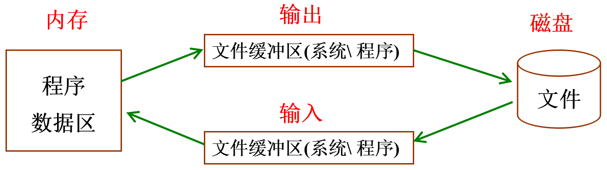

## 一 流

#### 1.0 流概述

流是一个动态的概念，字节在设备、文件和程序之间的传输就是流，类似于水在管道中的传输，所以流是对输入输出源的一种抽象，也是对传输信息的一种抽象。  

C语言中，I/O操作可以简单地看作是从程序移进或移出字节，这种搬运的过程便称为流(stream)。程序只需要关心是否正确地输出了字节数据，以及是否正确地输入了要读取字节数据。特定I/O设备的细节对程序员是隐藏的。

#### 1.1 文本流

文本流，即以文本模式读取文件。文本流的一些特性会因为操作系统的不同而不同。在不同的系统中可能不同。其中之一就是文本行的最大长度。标准规定至少允许254个字符。另一个可能不同的特性是文本行的结束方式。例如在Windows系统中，文本文件约定以一个回车符和一个换行符结尾。但是在Linux下只使用一个换行符结尾。  

标准C把文本定义为零个或者多个字符，后面跟一个表示结束的换行符(`\n`)。

#### 1.2 二进制流

二进制流中的字节将完全根据程序编写的形式写入到文件中，而且完全根据它们从文件或设备读取的形式读入到程序中，不会做任何改变。这种类型的流适用于非文本数据。  

#### 1.3 C语言对流的处理

C语言在处理这两种文件的时都会看成是字符流，按字节进行处理，不会有所区分。    

在程序中，文本方式打开文件和二进制方式打开文件仅仅体现在换行符的处理上。比如说，在Win下文件的换行符是`\r\n`，在Linux下换行符则是`\n`：
- 文件使用文本方式打开：Win系统中，文件中的换行符`\r\n`会被替换成`\n`读到内存中，写入文件的时`\n`被替换成`\r\n`再写入文件
- 文件使用二进制方式打开：Win系统中不进行`\r\n`和`\n`之间的转换，由于Linux下的换行符就是`\n`，所以文本文件方式和二进制方式无区别

## 二 文件指针

在C语言中用一个指针变量指向一个文件，该指针称为文件指针，通过文件指针才可对它所指的文件进行各种操作。   

文件指针在 `stdio.h`中声明如下：
```c
typedef struct {
	short           level;      //缓冲区"满"或者"空"的程度 
	unsigned        flags;      //文件状态标志 
	char            fd;         //文件描述符
	unsigned char   hold;	    //如无缓冲区不读取字符
	short           bsize;	    //缓冲区的大小
	unsigned char   *buffer;    //数据缓冲区的位置 
	unsigned        ar;	        //指针，当前的指向 
	unsigned        istemp;	    //临时文件，指示器
	short           token;	    //用于有效性的检查 
}FILE;
```

FILE是系统使用typedef定义出来的有关文件信息的一种结构体类型，结构中含有文件名、文件状态和文件当前位置等信息。  

C语言中有三个特殊的文件指针由系统默认打开，用户无需定义即可直接使用，它们都是一个指向FILE结构的指针:
- stdin： 标准输入，默认为当前终端（键盘），我们使用的scanf、getchar函数默认从此终端获得数据。
- stdout：标准输出，默认为当前终端（屏幕），我们使用的printf、puts函数默认输出信息到此终端。
- stderr：标准出错，默认为当前终端（屏幕），我们使用的perror函数默认输出信息到此终端。

贴士：
- 在C语言中，EOF表示文件结束符(end of file)，以EOF作为文件结束标志的文件，必须是文本文件。ASCII代码值的范围是0~127，不可能出现-1，因此可以用EOF作为文件结束标志。
- 当把数据以二进制形式存放到文件中时，就会有-1值的出现，因此不能采用EOF作为二进制文件的结束标志。为解决这一个问题，ANSI C提供一个 `feof `函数，用来判断文件是否结束，如果读到了结尾，返回非0值，没有到文件结尾返回0。
- `feof`函数既可用以判断二进制文件又可用以判断文本文件。

## 三 标准库函数

文件I/O的使用过程如下：
- 1.程序为同时处于活动状态的每个文件声明一个指针变量，其类型为FILE*。这个指针指向这个FILE结构，当它处于活动状态时由流使用。
- 2.根据需要对文件进行读写操作。
- 3.最后调用fclose函数关闭流。关闭一个流可以防止与它相关的文件被再次访问，保证任何存储于缓冲区中的数据被正确写入到文件中，并且释放FILE结构。
  
标准库函数是C语言提供的文件I/O相关函数，方便开发者直接调用，可以屏蔽很多底层细节，甚至不需要打开或者关闭。  

I/O函数以三种基本的形式处理数据：单个字符、文本行和二进制数据。对于每种形式都有一组特定的函数对它们进行处理。  

| 家族名 | 目的 | 可用于所有流 | 只用于stdin和stdout |
| ------ | ------ | ------ | ------ |
| getchar | 字符输入 | fgetc、getc | getchar |
| putchar | 字符输出 | fputc、putc | putchar |
| gets | 文本行输入 | fgets | gets |
| puts | 文本行输出 | fputs | puts |
| scanf | 格式化输入 | fscanf | scanf |
| printf | 格式化输出 | fprintf | printf |

总结：
- 按照字符读写文件：fgetc(), fputc()
- 按照行读写文件：fputs(), fgets()
- 按照块读写文件：fread(), fwirte()
- 按照格式化读写文件：fprintf(), fscanf()
- 按照随机位置读写文件：fseek(), ftell(), rewind()	


## 四 文件打开与关闭

#### 4.1 文件打开与关闭API

任何文件使用之前必须打开，文件打开API，示例：
```c
#include <stdio.h>

int main() {

    FILE *fp = NULL;

	// 打开文件
    fp = fopen("test.txt", "r");
    printf("fp = %p \n", fp);

	// 打开出错则返回 NULL，成功则返回文件指针
    if (fp == NULL) {
        perror("open");
		// 关闭文件
		fclose(fp);
		return -1;
    }

	// 关闭文件：成功则返回0，失败则返回-1
	fclose(fp);
   
    return 0;
}
```


贴士：
- 参数一：文件名，即文件路径，可以是相对路径，也可以是绝对路径，win中盘符路径为："c:/test/test1.txt"
- 参数二：文件模式，如：只读，只写等

任何文件在使用后应该关闭：
- 打开的文件会占用内存资源，如果总是打开不关闭，会消耗很多内存
- 一个进程同时打开的文件数是有限制的，超过最大同时打开文件数，再次调用fopen打开文件会失败
- 如果没有明确的调用fclose关闭打开的文件，那么程序在退出的时候，操作系统会统一关闭。

#### 4.2 文件模式

文件需要依照一定的模式来打开，比如：只读，只写，读写，有如下几种文件模式：
- r或rb：   以只读方式打开一个文本文件（不创建文件，若文件不存在则报错）
- w或wb：   以只写方式打开文件(如果文件存在则清空文件，文件不存在则创建一个文件)
- a或ab：   以追加方式打开文件，在末尾添加内容，若文件不存在则创建文件
- r+或rb+：	以可读、可写的方式打开文件(不创建新文件)
- w+或wb+：	以可读、可写的方式打开文件(如果文件存在则清空文件，文件不存在则创建一个文件)
- a+或ab+： 以添加方式打开可读、可写的文件。若文件不存在则创建文件；如果文件存在，则写入的数据会被加到文件尾后，即文件原先的内容会被保留。

注意： 
- 带b是以二进制流形式打开的意思，b只是在Windows有效，在Linux用r和rb的结果是一样的
- 在Windows平台下，以“文本”方式打开文件，不加b

## 五 文件缓冲区

ANSI C标准采用“缓冲文件系统”处理数据文件。  

缓冲文件系统是指系统自动地在内存区为程序中每一个正在使用的文件开辟一个文件缓冲区从内存向磁盘输出数据必须先送到内存中的缓冲区，装满缓冲区后才一起送到磁盘去。  

如果从磁盘向计算机读入数据，则一次从磁盘文件将一批数据输入到内存缓冲区(充满缓冲区)，然后再从缓冲区逐个地将数据送到程序数据区(给程序变量) 。  

  

更新缓冲区API：
```c
int fflush(FILE *stream);
功能：
	更新缓冲区，让缓冲区的数据立马写到文件中。
参数：
	stream：文件指针
返回值：
	成功：0
	失败：-1
```

文件操作完成后，如果程序没有结束，必须要用fclose()函数进行关闭，这是因为对打开的文件进行写入时，若文件缓冲区的空间未被写入的内容填满，这些内容不会写到打开的文件中。只有对打开的文件进行关闭操作时，停留在文件缓冲区的内容才能写到该文件中去，从而使文件完整。再者一旦关闭了文件，该文件对应的FILE结构将被释放，从而使关闭的文件得到保护，因为这时对该文件的存取操作将不会进行。文件的关闭也意味着释放了该文件的缓冲区。  