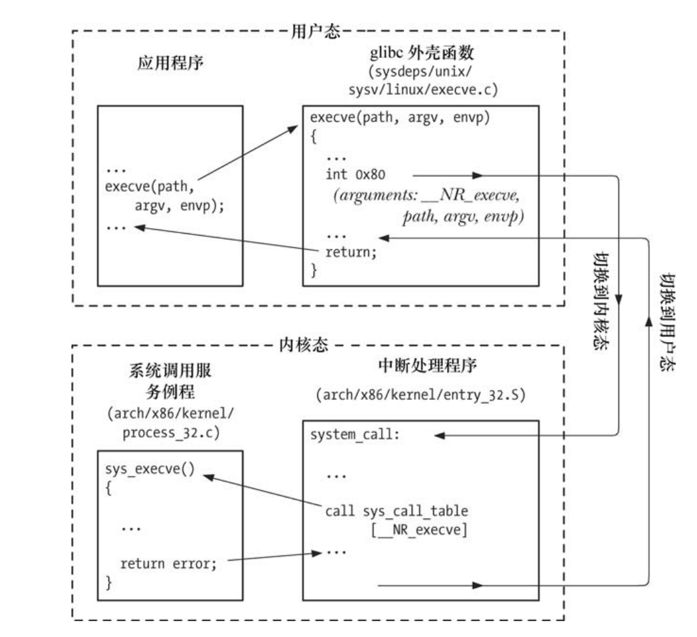

## 一 系统调用

操作系统以API形式提供了一系列的服务供程序访问，如：创建新进程、执行 I/O，以及为进程间通信创建管道等。  

系统调用：即借助这些API，进程可以请求内核以自己的名义去执行某些动作。  

系统调用的注意点：
- 系统调用将处理器从用户态切换到内核态，以便 CPU 访问受到保护的内核内存
- 系统调用的组成是固定的，每个系统调用都由一个唯一的数字来标识
- 每个系统调用可辅之以一套参数，对用户空间（亦即进程的虚拟地址空间）与内核空间之间（相互）传递的信息加以规范

系统调用的步骤：
- 1 应用程序通过调用 C 语言函数库中的外壳（ wrapper）函数，来发起系统调用
- 2 通过堆栈，外壳函数的参数被复制到寄存器
- 3 外壳函数将系统调用编号复制到一个特殊的CPU寄存器（%eax）中，这样才能让内核区分是哪个系统调用
- 4 外壳函数执行一条中断机器指令（int0x80），引发处理器从用户态切换到核心态，并执行系统中断 0x80 (十进制数 128)的中断矢量所指向的代码。
  - 贴士： 2.6 内核及 glibc 2.3.2 以后的版本持 新指令 sysenter
- 5 为响应中断 0x80，内核会调用 system_call()例程（位于汇编文件 arch/i386/entry.S 中）来处理该次中断，内部处理过程为：
  - 在内核栈中保存寄存器值
  - 审核系统调用编号的有效性
  - 查找所有服务历程列表（sys_call_table），找到系统调用编号对应的服务例程，执行必要的操作后将结果装填返回给system_call()例程
  - 从内核栈中恢复各寄存器值，并将系统调用返回值置于栈中
  - 返回至外壳函数，同时将处理器切换回用户态
- 6 若系统调用服务例程的返回值表明调用有误， 外壳函数会使用该值来设置全局变量 errno，然后，外壳函数会返回到调用程序，并同时返回一个整型值，以表明系统
调用是否成功。  

如下图所示execve调用系统调用执行过程：  

  

## 二 标准C语言库函数

GNU C 语言函数库 glibc（http://www.gnu.org/software/libc/ ）是 Linux 上最常用的实现。  

