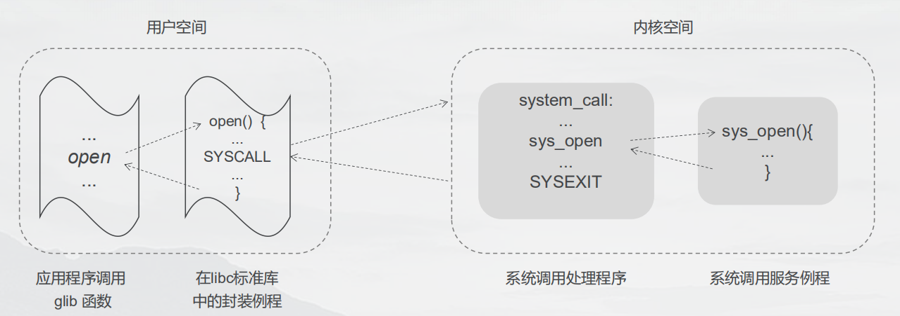

## 一 内核

#### 1.1 内核简介

操作系统往往有两种含义：
- 广义上：指可供用户使用的完整软件：包括管理计算机资源的核心层软件、附带的标准软件工具如命令行、图形界面、文件操作工具、文本编辑器等
- 狭义上：只指代管理和分配计算机资源（CPU、RAM、设备）的核心层软件，通常称为内核。  

没有内核计算机也能运行程序，但是程序本身需要书写大量代码，有了内核会极大简化其他程序的编写和使用，因为内核为管理计算机的有限资源提供了软件层。  

#### 1.2 内核职责

内核职责：
- 进程管理：创建、删除、调度
  - 内核可将新程序载入内存，为其提供运行所需的资源（比如， CPU、内存以及对文件的访问等），该运行的程序称为进程。
  - 一旦进程执行完毕，内核还要确保释放其占用资源，以供后续程序重新使用
  - Linux属于抢占式多任务操作系， “多任务”意指多个进程（即运行中的程序）可同时驻留于内存，且每个进程都能获得对 CPU 的使用权。“抢占”则是指一组规则。这组规则控制着哪些进程获得对 CPU 的使用，以及每个进程能使用多长时间，这两者都由内核进程调度程序（而非进程本身）决定。
- 内存管理：物理内存（ RAM）属于有限资源，内核必须以公平、高效地方式在进程间共享这一资源，Linux采用虚拟内存管理机制，有很多优势： 
  - 进程与进程之间、进程与内核之间彼此隔离，因此一个进程无法读取或修改内核或其他进程的内存内容
  - 只需将进程的一部分保持在内存中，这不但降低了每个进程对内存的需求量，而且还能在 RAM 中同时加载更多的进程。这也大幅提升了如下事件的发生概率，在任一时刻， CPU 都有至少一个进程可以执行，从而使得对 CPU 资源的利用更加充分
- 文件系统：内核在磁盘之上提供有文件系统，允许对文件执行创建、获取、更新以及删除等操作
- 支持外部设备访问：内核既为程序访问设备提供了简化版的标准接口，同时还要仲裁多个进程对每一个设备的访问。
- 网络支持：内核以用户进程的名义收发网络消息（数据包）。该任务包括将网络数据包路由至目标系统。
- 提供系统调用应用编程接口（ API）：进程可利用内核入口点（也称为系统调用）请求内核去执行各种任务。

#### 1.3 虚拟私有计算机（ virtual private computer）

Linux 之类的多用户操作系统会为每个用户营造一种抽象：虚拟私有计算机（ virtual private computer）。这就是说，每个用户都可以登录进入系统，独立操作，而与其他用户大致无干。例如，每个用户都有属于自己的磁盘存储空间（主目录）。再者，用户能够运行程序，而每一程序都能从 CPU 资源中“分得一杯羹”，运转于自有的虚拟地址空间中。而且这些程序还能独立访问设备，并通过网络传递信息。内核负责解决（多进程）访问硬件资源时可能引发的冲突，用户和进程对此则往往一无所知。  

#### 1.4 内核态和用户态

现代处理器架构一般允许 CPU 至少在两种不同状态下运行，即：用户态和核心态（有时也称之为监管态 supervisor mode）。  

执行硬件指令可使 CPU 在两种状态间来回切换。与之对应，可将虚拟内存区域划分（标记）为用户空间部分或内核空间部分。在用户态下运行时， CPU 只能访问被标记为用户空间的内存，试图访问属于内核空间的内存会引发硬件异常。当运行于核心态时， CPU 既能访问用户空间内存，也能访问内核空间内存。  

仅当处理器在核心态运行时，才能执行某些特定操作。这样的例子包括：执行宕机（halt）指令去关闭系统，访问内存管理硬件，以及设备 I/O 操作的初始化等。实现者们利用这一硬件设计，将操作系统置于内核空间。这确保了用户进程既不能访问内核指令和数据结构，也无法执行不利于系统运行的操作。  

一个运行系统通常会有多个进程并行其中。对进程来说，许多事件的发生都无法预期。执行中的进程不清楚自己对 CPU 的占用何时“到期”，系统随之又会调度哪个进程来使用CPU（以及以何种顺序来调度），也不知道自己何时会再次获得对 CPU 的使用。信号的传递和进程间通信事件的触发由内核统一协调，对进程而言，随时可能发生。诸如此类，进程都
一无所知。进程不清楚自己在 RAM 中的位置。或者换种更通用的说法， 进程内存空间的某块特定部分如今到底是驻留在内存中还是被保存在交换空间（磁盘空间中的保留区域，作为计算机 RAM 的补充）里，进程本身并不知晓。与之类似，进程也闹不清自己所访问的文件“居于”磁盘驱动器的何处，只是通过名称来引用文件而已。进程的运作方式堪称“与世隔绝” —进程间彼此不能直接通信。进程本身无法创建出新进程，哪怕“自行了断”都不行。最后还有一点，进程也不能与计算机外接的输入输出设备直接通信。

相形之下，内核则是运行系统的中枢所在，对于系统的一切无所不知、无所不能，为系统上所有进程的运行提供便利。由哪个进程来接掌对 CPU 的使用，何时“接任”， “任期”多久，都由内核说了算。在内核维护的数据结构中，包含了与所有正在运行的进程有关的信息。随着进程的创建、状态发生变化或者终结，内核会及时更新这些数据结构。内核所维护的底层数据结构可将程序使用的文件名转换为磁盘的物理位置。此外，每个进程的虚拟内存与计算机物理内存及磁盘交换区之间的映射关系，也在内核维护的数据结构之列。进程间的所有通信都要通过内核提供的通信机制来完成。响应进程发出的请求，内核会创建新的进程，终结现有进程。最后，由内核（特别是设备驱动程序） 来执行与输入/输出设备之间的所有直接通信， 按需与用户进程交互信息。

#### 1.5 shell

shell 是一种具有特殊用途的程序，主要用于读取用户输入的命令，并执行相应的程序以响应命令。有时，人们也称之为命令解释器。  

尽管某些操作系统将命令解释器集成于内核中，而对 UNIX 系统而言， shell 只是一个用户进程。   

常见shell：
- Bourne shell（ sh）： Steve Bourne 编写，历史悠久，是第七版UNIX的标配shell，包含特性有：I/O 重定向、管道、文件名生成（通配符）、变量、环境变量处理、命令替换、后台命令执行以及函数
- C shell（ csh）： Bill Joy 于加州大学伯克利分校编写而成，命名因为与C语法相似。csh与sh不兼容！
- Korn shell（ ksh）： AT&T 贝尔实验室的 David Korn 编写了这款 shell，保持了与 sh 兼容的同时，也吸收了 csh 交互式特性
- Bourne again shell（ bash）：这款 shell 是 GNU 项目对 Bourne shell 的重新实现。提供了与 C shell 和 Korn shel 所类似的交互式特性，Linux的上Bourne shell（ sh）其实正是由 bash 仿真提供的

## 二 系统编程概述

#### 2.1 系统编程三大基石

Linux系统编程有三大基石：
- 系统调用：系统编程的开始与结束都来自于系统调用（syscall），通过系统调用可以从操作系统获取一些服务、资源。
- C库：C库（libc）是Unix应用程序的核心，在Linux中，C库由GNU libc提供，简称glibc
- C编译器：在Linux中，标准C编译器由GNU编译器工具集（gcc）提供，编译器辅助实现了C语言标准、系统ABI

系统编程是建立在上述三大基石上而进行的开发工作！   

贴士：C语言在系统编程中占据绝对的地位，Linux的核心库、守护进程、工具箱、内核都由C语言实现，所以系统编程与C语言紧密相连。C++地位仅次于C，但是C++往往用于非Linux环境中的C升级版。

#### 2.2 API与ABI

应用程序的可移植性取决于两个方面：
- API：应用程序编程接口Application Programming Interface。定义了软件模块之间在源码层的交互接口
- ABI：应用程序二进制接口Application Binary Interface。定义了应用如何与内核、库交互，即关注调用字节序、寄存器、系统调用等系统的行为以及二进制目标格式，比如如何传递参数、使用哪些寄存器，如何获取返回值等。ABI一般通过编译器等工具链来实现！

#### 2.3 系统编程的标准

因为利益问题，UNIX的标准派系很多，主流的标准有：
- POSIX：电气电子工程师协会（IEEE）制定的标准
- SUS：免费的标准，现在SUS已经合并了最新的POSIX标准

Linux标准规范（LSB）是各大厂商在Linux基金会推动下制定，该规范扩展了POSIX和LSB。大多数厂商在一定程度上遵循LSB标准。   

#### 2.4 系统编程主要涉及内容

- 文件和文件系统：Linux中一切皆文件，文件在Linux中非常重要
- 进程：即应用程序，包含目标代码、数据、资源、状态等
- 进程间通信：进程间通信方式，如：信号、socket、管道等

## 三 系统调用

#### 3.1 系统调用概念

用户空间无法直接访问内核空间，为了让开发者能够使用系统资源，内核（操作系统最核心部分）必须提供一种机制，当用户空间的应用希望之星系统调用时，可以通过该机制通知内核，应用程序以此方式深入内核，执行内核允许的代码。  

该机制即系统调用函数。操作系统以API形式提供了一系列的服务供程序访问，如：创建新进程、执行 I/O，以及为进程间通信创建管道等。系统调用即应用程序借助这些系统提供的API，请求内核执行底层动作。  

系统调用示例图：  
 

内部请求转达图：  
  

系统调用的注意点：
- 系统调用将处理器从用户态切换到内核态，以便 CPU 访问受到保护的内核内存
- 系统调用的组成是固定的，每个系统调用都由一个唯一的数字来标识
- 每个系统调用可辅之以一套参数，对用户空间（亦即进程的虚拟地址空间）与内核空间之间（相互）传递的信息加以规范

为什么需要系统调用：
- 把用户从底层硬件编程中解放出来，降低开发难度
- 提高安全性，因为用户进程与内核进行了隔离
- 统一的开放接口可以使用户程序具备了可移植性，适应不同平台不同硬件

#### 3.2 系统调用的实现

Linux软件中断（软件指令触发的中断）实现了系统调用，Linux内核会响应软件中断，从用户态切换到内核态，然后执行相应的系统调用。  

系统调用的步骤：
- 1 应用程序通过调用 C 语言函数库中的外壳（ wrapper）函数，来发起系统调用
- 2 通过堆栈，外壳函数的参数被复制到寄存器
- 3 外壳函数将系统调用编号复制到一个特殊的CPU寄存器（%eax）中，这样才能让内核区分是哪个系统调用
- 4 外壳函数执行一条中断机器指令（int0x80），引发处理器从用户态切换到核心态，并执行系统中断 0x80 (十进制数 128)的中断矢量所指向的代码。
  - 贴士： 2.6 内核及 glibc 2.3.2 以后的版本持 新指令 sysenter
- 5 为响应中断 0x80，内核会调用 system_call()例程（位于汇编文件 arch/i386/entry.S 中）来处理该次中断，内部处理过程为：
  - 在内核栈中保存寄存器值
  - 审核系统调用编号的有效性
  - 查找所有服务历程列表（sys_call_table），找到系统调用编号对应的服务例程，执行必要的操作后将结果装填返回给system_call()例程
  - 从内核栈中恢复各寄存器值，并将系统调用返回值置于栈中
  - 返回至外壳函数，同时将处理器切换回用户态
- 6 若系统调用服务例程的返回值表明调用有误， 外壳函数会使用该值来设置全局变量 errno，然后，外壳函数会返回到调用程序，并同时返回一个整型值，以表明系统
调用是否成功。  

如下图所示execve调用系统调用执行过程：  

 

#### 3.3 glibc

glibc是Linux下的开源标准C库，提供的库函数可以发起系统调用。  
- 每个特定系统调用都对应了至少一个glibc封装的库函数
- 多个API也可能只对应一个系统调用
- 返回值-1在大多数情况下表示内核不能满足进程请求
- Libc中定义的errno变量包含特定的出错码

示例：
```c
#include <sys/types.h>
#include <sys/stat.h>
#include <errno.h>
#include <stdio.h>

int main() {
    int rc;
    rc = chmod("./test.txt", S_IWUSR | S_IWGRP | S_IWOTH);
    if (rc == -1) {
        fprintf(stderr, "chmod failed, errno = %d\n", errno);
    } else {
        printf("chomod success!\n");
    }
    return 0;
}
```


#### 3.4 syscall

glibc也提供了 `syscall` 函数直接调用系统调用。  

函数原型：`long int syscall(long int sysno, ...);`
- sysno 是系统调用号，参见 sys/syscall.h
- ... 为剩余可变长参数，根据系统调用的不同，可携带0-5个不等参数，超过该长度的参数将会被忽略
- 返回值为特定系统调用的返回值，失败返回-1，错误代码存放在errno中

示例：
```c
#include <sys/syscall.h>
#include <sys/stat.h>
#include <unistd.h>
#include <errno.h>
#include <stdio.h>

int main() {
    int rc;
    rc = syscall(SYS_chmod, "./test.txt", S_IROTH | S_IRGRP | S_IRUSR);
    if (rc == -1) {
        fprintf(stderr, "chmod failed, errno = %d\n", errno);
    } else {
        printf("chomod success!\n");
    }
    return 0;
}
```
 
#### 3.5 glibc与syscall对比

glibc函数：更加上层，只需要使用api即可调用，不必知道调用号等细节，但是没有封装某个内核提供的系统调用时无法使用
syscall调用：可定制自己的系统调用，但是使用不方便。  

实践：
- 频繁使用底层系统调用会影响程序效率（因为用户态与内核态切换）
- 多用glibc库，尽可能少调用系统接口