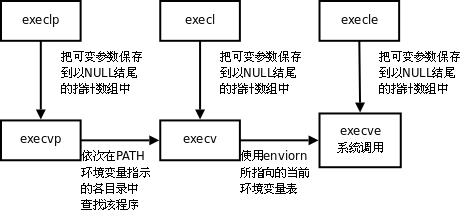

## 一 进程执行 exex()

子进程被创建后：
- 要么去执行与父进程共享代码段中的另一组不同函数
- 要么使用系统调用 exec 函数去加载并执行一个全新程序。 

贴士：exec 函数会销毁现有的文本段、数据段、栈段及堆段，并根据新程序的代码，创建新段来替换它们。  

有六种 exec 函数：
- `int execl(const char *path, const char *arg, ...);`
- `int execlp(const char *file, const char *arg, ...);`
- `int execle(const char *path, const char *arg, ..., char *const envp[]);`
- `int execv(const char *path, char *const argv[]);`
- `int execvp(const char *file, char *const argv[]);`
- `int execve(const char *path, char *const argv[], char *const envp[]);`

贴士：这些函数参数如果是可变参数，则最后一个参数为 NULL 代表参数结束。

## 二 常见 exec 函数的使用

### 2.1 execlp

execlp可以借助PATH环境便令加载一个进程：
- 成功：无返回
- 失败：返回-1

```c
#include <stdio.h>
#include <stdlib.h>
#include <unistd.h>

int main() {

    printf("-------start-------\n");

    pid_t pid;
    pid = fork();
    if (pid == -1) {
        perror("fork error:");
        exit(1);
    }

    if (pid > 0) {
        sleep(2);
        printf("parrent \n");
    } else {
        execlp("ls", "-l", "-a", NULL);
    }

    printf("-------end-------\n");
    return 0;
    
}
```

### 2.2 execl

execl函数通常使用路径+程序名的方式加载一个进程，成功则无返回，失败则返回-1。
```c
 execlp("./test", "test", NULL);
```

对比execlp，如果加载"ls"命令带有-l，-F参数
- `execlp("ls", "ls", "-l", "-F", NULL);`：使用程序名在PATH中搜索。
- `execl("/bin/ls", "ls", "-l", "-F", NULL);`：使用参数1给出的绝对路径搜索。

### 2.3 execvp

execvp 使用自定义环境变量 env 加载一个进程。  

将当前系统中的进程信息，打印到文件中：
```c
#include <stdio.h>
#include <stdlib.h>
#include <unistd.h>
#include <fcntl.h>

int main() {

    int fd;

    fd = open("ps.out", O_WRONLY | O_CREAT | O_TRUNC, 0644);
    if (fd < 0) {
        perror("open file error");
        exit(1);
    }

    dup2(fd, STDOUT_FILENO);
    execlp("ps", "ps", "ax", NULL);
    return 0;
    
}
```

贴士：dup2() 函数中，其参数 0 代表 stdin，1 代表 stdout，2 代表 stderr，3 代表file文件指针

## 三 exec 函数规律

exec函数一旦调用成功即执行新的程序，不返回。只有失败才返回错误值-1。所以通常我们直接在exec函数调用后直接调用perror()和exit()，无需if判断。  

其函数名意义：
- l (list)：命令行参数列表
- p (path)：搜索file时使用path变量
- v (vector)：使用命令行参数数组
- e (environment)：使用环境变量数组，不使用进程原有的环境变量，设置新加载程序运行的环境变量

只有 execve 才是真正的系统调用，其他五个函数最终都会调用  execve，如图所示：  

