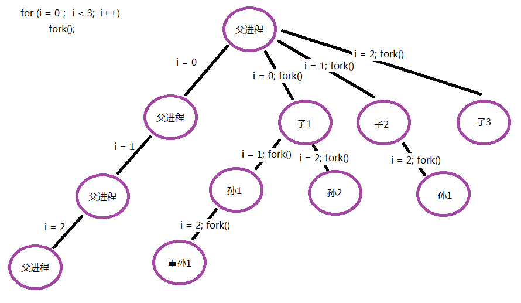

## 一 了解进程

> 进程：正在执行的程序实例。

执行程序时，内核会将程序代码载入虚拟内存，为程序变量分配空间，建立一个进程控制块 PCB 来维护进程相关信息，在Linux内核中，它是 task_struct 结构体，位于 `/usr/src/linux-headers-3.16.0-30/include/linux/sched.h`。该数据结构主要包括：
- 进程ID：进程的唯一标识，类型为 pid_t ，其实就是一个非负整数
- 进程状态：就绪、运行、挂起、停止等状态
- 进程切换时需要保存和恢复的一些CPU寄存器信息
- 文件描述符表：包含很多指向 file 结构体的指针
- 该进程的用户id和组id
- 该进程所属的会话与进程组

## 二 进程创建 fork()

### 2.1 进程的创建

进程可使用系统调用 fork() 来创建一个新进程。调用 fork() 的进程被称为父进程，新创建的进程则被称为子进程。  

内核通过对父进程的复制来创建子进程。子进程从父进程处继承数据段、栈段以及堆段的副本后，可以修改这些内容，不会影响父进程的“原版”内容。 

注意：在内存中被标记为只读的程序文本段则由父、子进程共享。   

进程被创建后，都会拥有自己的唯一标识 PID ，即一个唯一的整型数字，每个进程还具有一个父进程标识符（ PPID）属性，用以标识请求内核创建自己的进程。 

### 2.2 fork()函数

```c
#include <stdio.h>
#include <stdlib.h>
#include <unistd.h>

int main() {

    printf("-------start-------\n");

    pid_t pid;                      // 进程ID，有符号整型（因为还可能为-1）
    pid = fork();

    if (pid == -1){
        perror("fork error:");
        exit(1);
    }

    if (pid == 0) {
        printf("child pid = %u, ppid = %u\n ", getpid(), getppid());
    } else {
        printf("parent pid = %u, ppid = %u\n", getpid(), getppid());
        sleep(1);
    }

    printf("-------end-------\n");
    return 0;
    
}
```

`pid_t fork(void);`函数的返回值：
- 调用失败：返回 -1
- 调用成功：子进程返回 0，父进程返回子进程的ID

注意：
- 虽然子进程会拥有完整的父进程代码，但是只会执行从fokr位置开始后的代码
- 0不是有效进程ID，示例中 pid=0 并不是子进程ID为0
- 操作系统的init进程是ID最小的进程，值为1
- fork成功后返回了2个值存储在pid中，并不是该函数返回了2个值。而是父子进程分别返回了一个值。

### 2.3 获取进程ID函数

获取进程ID函数：
- `pid_t getpid(void);`：获取当前进程ID
- `pid_t getppid(void);`：获取当前进程的父进程ID

获取进程用户ID：
- `uid_t getuid(void);`：获取当前进程实际用户ID
- `uid_t geteuid(void);`：获取当前进程有效用户ID

获取进程使用的用户组ID：
- `gid_t getgid(void);`：获取当前进程使用用户组ID
- `gid_t getegid(void);`：获取当前进程有效用户组ID

贴士：区分一个函数是系统函数还是库函数的依据是：是否访问内核数据，是否访问外部硬件，满足任意一个即是系统函数。

## 三 循环创建子进程

如果直接对 `fork()` 函数进行循环，以创建子进程，如下所示：
```
for(i = 0; i < n; i++) { fork() } 
```
那么创建的子进程数目会远远超过需要的进程数，因为父进程没有退出该循环，创建的子进程也会进入该循环，各自都在循环创建新的子进程，从而产生了树状的进程关系：  

  

循环创建子进程正确代码：
```c
#include <stdio.h>
#include <stdlib.h>
#include <unistd.h>

int main() {

    printf("-------start-------\n");

    pid_t pid;
    int i;
    for (i = 0; i < 5; i++) {       // 创建5个子进程
        pid = fork();
        if (pid == -1){
            perror("fork error:");
            exit(1);
        }
        if (pid == 0) {
            break;              // 一旦创建成功，子进程跳出循环
        }
    }

    sleep(i);

    if (i < 5) {
        printf("child pid = %u, ppid = %u\n ", getpid(), getppid());
    } else {
        printf("parent pid = %u, ppid = %u\n", getpid(), getppid());
    }

    printf("-------end-------\n");
    return 0;
    
}
```

## 四 进程共享

在fork后，父子进程的关系：
- 相同点：全局变量、.data、.text、栈、堆、环境变量、用户ID、宿主目录、进程工作目录、信号处理方式...
- 不同点：各自进程ID、各自父进程ID、各自fork返回值、进程运行时间、闹钟(定时器)、未决信号集

注意：
- 子进程并不是复制了父进程0-3G的用户控件内容，以及其PCB，而是遵循了 `读时共享，写时复制` 原则。这样设计，无论子进程执行父进程的逻辑还是执行自己的逻辑都能节省内存开销。所以一定要躲避父子进程共享全局变量的知识误区！
- fork之后父进程先执行还是子进程先执行不确定，取决于内核所使用的调度算法