## 一  网络概念

### 1.1 因特网与端系统

> **因特网**：世界范围的计算机网络，互联了全世界亿级数量的网络设备。

这些设备可以是：传统PC、Linux工作站、移动设备、安全系统等等，他们统称为**主机(host)/端系统(end system)**。

### 1.2 端系统的连接

> **分组**（packet）：一台端系统向另一台端系统发送时，发送端系统将数据分段，为每段都加上首部字节，形成的数据包称为分组。

端系统之间如果要连接（发送与接收数据），需要两个因素：
- **通信链路**（communication link）：负责传输数据，一般是类似光纤、无线电频谱这样的物理媒体。
  - 传输速度单位为：比特/秒（bit/s，或bps）
- **分组交换机**（packet switch）：负责从 入通信链路 中接收到达的分组，并从一条 出通信链路 中转发该分组。
  - 常见的有路由器（roter）、链路层交换机（link-layer switch），他们都是用来向最终目的地转发分组。

> **路径**（path/route）:从最初的发送端到最终的接收端，一个分组所经历的一系列通信链路、分组交换机称为路径。类似现实中的交通网络，分组要到达目的地，需要选择计算机网络中的一条路径前行。

端系统通过因特网服务提供商（Internet Service Provider，ISP）接入因特网，他们会提供在机场、旅馆、公司等地可以接入的ISP。IPS也会将各种Web站点接入因特网。底层的ISP通过国家的高层ISP互联起来。  

   

### 1.3 协议

> **协议**（protocol）：用来定义两个、多个通信实体之间交换的报文格式、次序，以及在发送与接收时需要采取的动作

在现实生活中，我们与别人交流也是需要一定的步骤的，比如先打招呼，计算机也同样如此，下图展示了一个粗略的协议规范：  
   

端系统、分组交换机等都需要支持一系列协议，这些协议控制网络中的信息的接收和发送。因特网的主要协议统称为TCP/IP协议，这是2个协议：
- TCP（Transmission Control Protocol）：传输控制协议。
- IP（Internet Protocol）：网际协议，定义了路怄气和端系统之间发送、接收分组的格式。

因特网标准工程任务组（IETF）出台了相关标准文档，称为请求评论（Request For Comment，**RFC**），RFC文档定义了
TCP、IP、HTTP等协议标准，以及以太网、无限WiFi的标准。  

### 1.4 总结

```
端系统之间彼此要交换的数据称之为 报文（message）；
报文必须在源被划分为较小的数据块之后才能发送，即分组（packet）；
源与目的之间，每个分组通过通信链路、分组交换机传输；
```

## 二 网络边缘

端系统内运行着大量应用程序，这些应用程序位于网络的边缘，通过API接口向网络中发送数据。有时候，端系统也会被进一步划分为：**客户端(client)**、**服务端(server)**。   

**边缘路由器**（edge router）是端系统到任何其他远程端系统路径上的第一台路由器，即应用程序接入网络的第一步（access network）。  

接入互联网的方式有很多：
- 家庭接入：
  - DSL：从本地电话，利用家庭电话线接入本地电话公司处获得因特网接入。
  - 电缆：利用有线电视公司的有线电视设施接入。
  - 光纤：从本地中心局直接提供一条光纤路径连接到家庭
  - 拨号：与DSL相同，利用传统电话线接入，但是拨号速度极慢
  - 卫星：利用卫星链路接入
- 企业接入：一般利用局域网将端用户连接到边缘路由器
  - 以太网：使用双绞线和一台以太网交换机相连，以太网交换机再与更大的因特网相连

## 三 网络核心

### 3.0 数据传输的基本方法

网络链路和交换机移动数据的基本方法有两种：
- 分组交换（packet switching）
- 电路交换（circuit switching）

### 3.1 分组交换

#### 3.1.1 网络传输时间

如果源或分组交换机在某个链路上发送一个 L比特 的分组，链路传输速率为 R比特/秒，则传输事件为 L/R 秒：
```
网络传输时间 = L/R 秒 （L为分组大小：比特，R为传输速度 比特/秒）
```

#### 3.1.2 存储转发传输

> **存储转发传输机制**（store-and-forward transmission）：交换机必须先接收到整个分组后，才能向输出链路传输，即先缓存下来完成的分组，然后再转移到另一条链路。

通过由 N 条速度为 R 的链路组成的路径，端到端发送一个分组的时延是：  

$$ d_{端到端} = N\frac{L}{R}$$

#### 3.1.3 排队时延和分组丢失

每个分组交换机都连接了多条链路，分组交换机在每条链路上都具有一个 **输出缓存**(output buffer)，也称为 **输出队列**(output queue)，用于存储路由器准备发往该链路的分组。如果分组到达后，却发现该链路整忙于传输其他分组，新到达的分组就必须在缓存中等待，这就会造成 **排队时延**(queue delay)。  

排队时延是会变化的，取决于网络的拥塞程度。  

缓存的大小有限，若分组到达后，发现该缓存已经被其他等待传输的分组占满，则新到达的分组或者在排队的分组之一会被丢弃，这是 **分组丢失（丢包）**。  

拥塞示例：链路的速率是 1.5Mbps，分组的到达路由器的到达率（换算为每秒比特）超过了 1.5Mbps，就会在缓存中排队。

#### 3.1.4 转发表和路由选择协议

源主机在向目的端系统发送一个分组时，分组的头部会包含目的的IP地址，该分组若到达网络中的路由器，路由器会在内部的 **转发表**（forwarding table），找到合适的输出链路。很类似现实中的驾车路线选择。  

**路由选择协议**（routing protocol）是设置转发表的协议，如：决定从每台路由器到每个目的地的最短路径。

### 3.2 电路交换

在电路交换网络中，端系统如果开始会话，则会预留端系统间通信沿路径所需要的资源（缓存，链路传输速率），而分组交换网络中，这些资源不是预留的，也即会造成排队。   

传统的电话网络是电路交换网络的案例，双方在通信时，必须建立一条实际的连接，该路径上的交换机都需要维护连接状态。  

如图所示：  

  

在上图中，有4条链路连接着4台电路交换机，每条链路中包含3条电路，因此每条链路能支持3条并行的连接。如果一台电路交换机与另外一台电路交换机要发送报文，网络中必须在两条链路之一上预留一条电路，在链接七届，也就只能获得带宽的1/3部分。  

电路交换存在静默期（solent period），即类似打电话的一个人停止说话，则空闲的资源其他进行中的链接无法使用，从而造成了浪费。  

### 3.3 分组交换与电路交换对比

- 分组交换不适合实时服务：端到端的时延不可预测（因为排队时延不可预测）。  
- 分组交换能提供比电路交换更好的带宽共享，比电路交换简单有效，成本更低。比如多个用户共享1Mbps链路，用户的活跃周期是变化的，某用户时而以100kbps恒定速率产生数据，时而静止不再产生数据，如果采用电路交换，则需要为每个用户都预留100kbps，那么电路交换支持的用户并发数就会很低。 

## 四 时延与丢包

### 4.1 分组交换网络中的时延概述

分组从源触发后，在经过一系列路由，最终到达目的地，这期间分组在每个节点都经受了几种不同类型的时延，结点总时延（total nodal delay）主要包括以下四部分：
- 处理时延（nodal processing delay）：包括检查分组首部、决定将改分组导向何处、检查比特级差错等造成的时延。
- 排队时延（queuing delay）：分组在链路上等待传输造成的时延。一般等待队列为空，且没有其他分组正在传输，则排队时延为0
- 传输时延（transmission delay）：所有分组推向链路所需时间。必须等待所有已到达分组传输完毕后，才能传输刚到达的分组。
  - 传输时延值为 $L/R$，
- 传播时延（propagation delay）：分组被推向链路后，从该链路的起点到下一个路由器所需要的时间为传播时延。传播时延
  - 该时延取决于链路的物理媒体。一般速率范围是：$2\times10^8$ ~ $3\times10^8$，该速度略小于光速
  - 传播时延值为 $ d/s $。d是两个路由器距离，s是链路传播速率。

贴士：传输时延是路由器将分组退出所需时间，传播时延是分组在2个路由间传输时间。

### 4.2 排队时延

在排队时延场景中，如果10个分组同时到达空队列，传输的第一个分组没有排队时延，传输的最后一个分组却会受到最大排队时延。所以需要使用统计量测度，如平均排队时延、排队时延的方差、排队时延超过某些特定值的概率。  

排队时延取决于：到达该队列的速率、链路的传输速率、到达的流量是周期性还是突发形式。  

**流量强度**（traffic intensity）的公式为：$La/R$。每个分组大小为L比特，分组到达队列的平均速率a（单位分组/秒，pkt/s），R是传输速率。  

如果 $La/R>1$，则比特到达队列的平均速率超过从该队列传输出去的速率，此时会造成队列无限增加，排队延时也会趋向无穷大，所以设计系统流量强度的准则是：**其值不能大于1**。  

在$La/R\leq1$时，影响排队时延的主要因素就是流量的性质，即是周期性到达还是突然大量到达。
```
若分组周期性到达：即每 L/R 秒到达一个分组，则每个分组都会到达空队列，不会有排队时延。  

若分组突发到达：假设每 （L/R）N秒同时到达N个分组，则传输的第一个分组没有排队时延，传输的第二个分组有 L/R 秒的排队时延。
```  

上述的案例都是非常理想的情况，分组在实际中到达的过程是随机的，平均排队时延与流量强度关系为：  

  

### 4.3 丢包

如果到达的分组发现队列为满，由于没有地方存储这个分组，路由器将会丢弃（drop）该分组，即分组会丢失（lost）。  

分组丢失份额随着流量强度的增加而增加，所以一个节点的性能不仅根据时延来度量，还要根据分组丢失的概率来度量。  

### 4.4 吞吐量

> 计算机网络性能测度有三个重要指标：时延、丢包、端到端吞吐量。  

比如文件在传播时，有两个吞吐量指标：
- 瞬时吞吐量（instantaneous throughput）：接受党接收到文件的速率（bps）
- 平均吞吐量（average throughput）：接收F比特，耗时T秒，则平均吞吐量为 $F/T bps$

如图所示：服务端向客户端推送一个大文件，中间只经过一个路由，服务端与路由之间链路速率为 $R_s$，路由与客户端之间的速率为  $R_c$：  

  

其吞吐量应该计算为瓶颈链路（bot-tleneck link）的传输速率，即：    
$min\left\{R_s, R_c \right\}$  

解析：
- 如果$R_s < R_c$，服务端数据到达路由后，同样能够顺利的到达客户端，但是其速率只能是 $R_s$
- 如果$R_s > R_c$，服务端以较大速度 $R_s$ 到达路由后，不能再以该速率继续传输，而是更改为 $R_c$速率。

所以传输F比特大文件，其所需时间为：  
$F/min\left\{R_s, R_c \right\}$  

在上述案例的基础上，假定有10个客户端在下载文件，且都会走一个速率为R的公共链路，此时的吞吐量会是多少？
```
如果公共速率R远大于Rs与Rc，那么吞吐量仍然会是 Rs与Rc 中较小的
如果公共速率R并不是很大，Rs=2Mbps，Rc=1Mbps，R=5Mbps，10个客户端平均划分传输速率，此时下载瓶颈就会位于共享链路中，吞吐量就会降低到 500kbps。
```