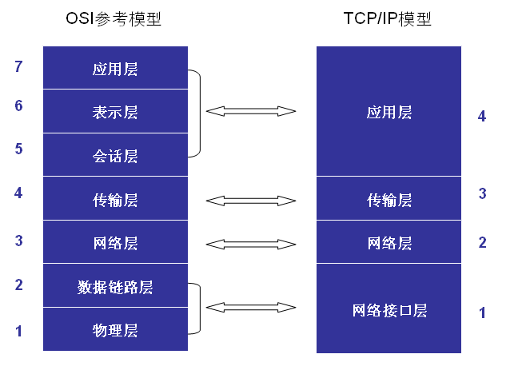
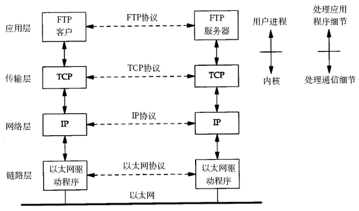
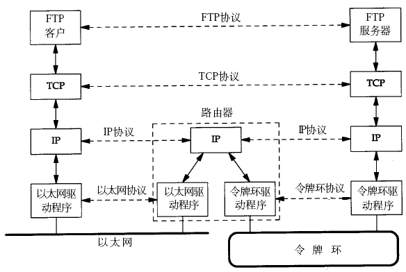

## 一 网络分层模型

### 1.0 分层模型图示

如图所示：  
  

### 1.1 OSI七层模型

七层模型可以快速背诵为：物、数、网、传、会、表、应。  

物理层
```
概念：用来定义物理设备标准，如网线的接口类型、传输介质的传输速率等。
作用：传输比特流（由1、0转化为电流强弱来进行传输，到达目的地后再转化为1、0，即数模转换与模数转换）。该层数据称为比特。
```

数据链路层：
```
概念：定义如何让格式化数据以帧为单位进行传输
作用：控制对物理介质的访问，还提供错误检测和纠正，以确保数据的可靠传输
```

网络层：
```
概念：为位于不同地理位置的网络中的两个主机系统之间提供连接和路径选择
```

传输层：
```
概念：定义传输数据的协议和端口号（WWW端口80等），如：TCP、UDP
作用：将从下层接收的数据进行分段和传输，到达目的地址后再进行重组。常常把这一层数据叫做段。
```

会话层：
```
概念：通过传输层建立数据传输的通路。
作用：主要在系统之间发起会话或者接受会话请求（设备之间需要互相认识可以是IP也可以是MAC或者是主机名）。
```

表示层：
```
概念：确保一个系统的应用层所发送的信息可以被另一个系统的应用层读取。例如，PC程序与另一台计算机进行通信，其中一台计算机使用扩展二一十进制交换码(EBCDIC)，而另一台则使用美国信息交换标准码（ASCII）来表示相同的字符。如有必要，表示层会通过使用一种通格式来实现多种数据格式之间的转换。
```

应用层：
```
概念：最靠近用户的OSI层，为用户的应用程序（例如电子邮件、文件传输和终端仿真）提供网络服务。
```

### 1.2 TCP/IP四层模型

TCP/IP网络协议栈分为：
- 应用层（Application）：用于对数据进行封装、解封。常见应用有Telnet、FTP、Email等
- 传输层（Transport）：可以设置端口，在一台主机上唯一标识一个进程。常见协议有TCP、UDP
- 网络层（Network）：常见协议有IP、ICMP、IGMP
- 链路层（Link）：常见协议有ARP，用于借助IP获取mac地址。该层也称呼为网络接口层，主要是设备驱动程序和接口卡

在应用开发中，一般遵循TCP/IP模型。  

## 二 网络通信的过程

在同一个网段中，两台机器之间通信过程如图：  

  

在不同的网段中，两台机器之间通信过程如图： 

  

链路层有以太网、令牌环网等标准，负责网卡设备的驱动、帧同步（即从网线上检测到什么信号算作新帧的开始）、冲突检测（如果检测到冲突就自动重发）、数据差错校验等工作。交换机是工作在链路层的网络设备，可以在不同的链路层网络之间转发数据帧（比如十兆以太网和百兆以太网之间、以太网和令牌环网之间），由于不同链路层的帧格式不同，交换机要将进来的数据包拆掉链路层首部重新封装之后再转发。  

网络层的IP协议是构成Internet的基础。Internet上的主机通过IP地址来标识，Inter-net上有大量路由器负责根据IP地址选择合适的路径转发数据包，数据包从Internet上的源主机到目的主机往往要经过十多个路由器。路由器是工作在第三层的网络设备，同时兼有交换机的功能，可以在不同的链路层接口之间转发数据包，因此路由器需要将进来的数据包拆掉网络层和链路层两层首部并重新封装。IP协议不保证传输的可靠性，数据包在传输过程中可能丢失，可靠性可以在上层协议或应用程序中提供支持。  

网络层负责点到点（ptop，point-to-point）的传输（这里的“点”指主机或路由器），而传输层负责端到端（etoe，end-to-end）的传输（这里的“端”指源主机和目的主机）。传输层可选择TCP或UDP协议。

