## 一 网络分层模型

### 1.1 分层模型图

网络设计者以分层（layer）方式组织协议以及实现这些协议的网络硬件和软件，分层提供了一种结构化的方式来讨论系统组件，模块化也使得更新系统中组件更加容易。当然分层在某种程度上也会造成冗余。  

各层所有的协议被称为协议栈（protocol stack），其层次划分如图所示：  

  

贴士：标准TCP/IP是一个四层体系结构，但是从实质上来讲，TCP/IP只有最上面三层，因为网络接口层与一般通信链路在功能上没有太多差别，在学习时候，采用折中方式，即五层协议体系。  

贴士：在实际应用开发中，一般遵循TCP/IP标准模型。   

贴士：七层模型可以快速背诵为：物、数、网、传、会、表、应。

### 1.2 TCP/IP 各层作用

TPC/IP的四层模型为：
- **应用层**：网络应用程序所在地，用于对数据进行封装、解封。包括协议有：HTTP（web协议）、SMTP（邮件协议）、FTP等（文件传输协议）等。应用层的信息分组称呼为报文（message）。
- **传输层**：在应用程序端点之间传送应用层报文，可以在一台主机上唯一标识一个进程。包括协议有TCP（面向连接）、UDP（无连接）等。传输层分组称为报文段（segment）。
- **网际层**：负责将数据从一台主机移动到另一台主机，包括协议有：IP协议。该层分组数据称为数据报（datagram）。
- **网络接口层**：该层其实就是链路层与物理层的综合。
  - 链路层：定义如何让格式化数据以帧为单位进行传输，控制对物理介质的访问，还提供错误检测和纠正，以确保数据的可靠传输。
  - 物理层：用来定义物理设备标准，如网线的接口类型、传输介质的传输速率等。传输比特流（由1、0转化为电流强弱来进行传输，到达目的地后再转化为1、0，即数模转换与模数转换）。该层数据称为比特。

### 1.3 OSI七层模型

OIS七层模型多出了表示层和会话层：
- **表示层**：确保一个系统的应用层所发送的信息可以被另一个系统的应用层读取。例如，PC程序与另一台计算机进行通信，其中一台计算机使用扩展二一十进制交换码(EBCDIC)，而另一台则使用美国信息交换标准码（ASCII）来表示相同的字符。如有必要，表示层会通过使用一种通格式来实现多种数据格式之间的转换。
- **会话层**：通过传输层建立数据传输的通路，主要在系统之间发起会话或者接受会话请求（设备之间需要互相认识可以是IP也可以是MAC或者是主机名）。

TCP/IP四层模型认为这两层应该留给应用程序开发者处理。  

## 二 封装与传输

数据的传输过程如图所示：  

  

**封装**（encapsulation）：在发送端，对数据添加附加信息，以让下一层在接收数据时获得一些数据的信息，每层封装后数据的称谓都会发生变化，在发送端变化为：报文-->报文段-->数据报-->帧。  

在每一层，一个分组都有两种类型的字段：首部字段、收效载荷字段（playload field）。其中，有效载荷字段来自上一层分组。  
