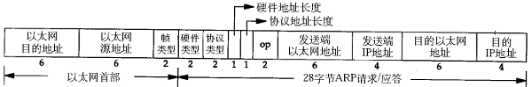
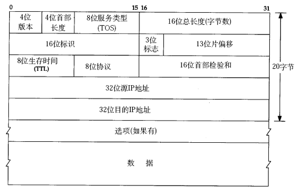
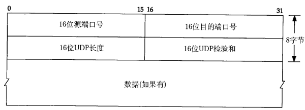
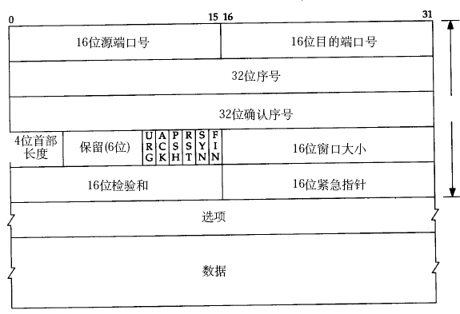

## 一 数据包封装概念

应用层数据通过协议栈发到网络上时，每层协议都要加上一个数据首部（header），称为封装（Encapsulation），如下图所示：  

  

不同的协议层对数据包有不同的称谓，在传输层叫做段（segment），在网络层叫做数据报（datagram），在链路层叫做帧（frame）。  

数据封装成帧后发到传输介质上，到达目的主机后每层协议再剥掉相应的首部，最后将应用层数据交给应用程序处理。  

## 二 以太网帧格式

以太网帧格式如图所示：  

 

图中原地址和目的地址都是指网卡的硬件地址（MAC地址），长度是48位，可以使用ifconfig命令查看。  

协议字段有三种值，分别对应IP、ARP、RARP，帧尾是CRC校验码。  

以太网帧中的数据长度规定最小46字节，最大1500字节，ARP和RARP数据包的长度不够46字节，要在后面补填充位。最大值1500称为以太网的最大传输单元（MTU），不同的网络类型有不同的MTU，如果一个数据包从以太网路由到拨号链路上，数据包长度大于拨号链路的MTU，则需要对数据包进行分片（fragmentation）。ifconfig命令输出中也有“MTU:1500”。注意，MTU这个概念指数据帧中有效载荷的最大长度，不包括帧头长度。  

## 三 ARP数据报格式

在网络通讯时，源主机的应用程序知道目的主机的IP地址和端口号，却不知道目的主机的硬件地址，而数据包首先是被网卡接收到再去处理上层协议的，如果接收到的数据包的硬件地址与本机不符，则直接丢弃。因此在通讯前必须获得目的主机的硬件地址。ARP协议就起到这个作用。源主机发出ARP请求，询问“IP地址是192.168.0.1的主机的硬件地址是多少”，并将这个请求广播到本地网段（以太网帧首部的硬件地址填FF:FF:FF:FF:FF:FF表示广播），目的主机接收到广播的ARP请求，发现其中的IP地址与本机相符，则发送一个ARP应答数据包给源主机，将自己的硬件地址填写在应答包中。  

每台主机都维护一个ARP缓存表，可以用arp -a命令查看。缓存表中的表项有过期时间（一般为20分钟），如果20分钟内没有再次使用某个表项，则该表项失效，下次还要发ARP请求来获得目的主机的硬件地址。想一想，为什么表项要有过期时间而不是一直有效？  

ARP数据报的格式如下所示：

   

源MAC地址、目的MAC地址在以太网首部和ARP请求中各出现一次，对于链路层为以太网的情况是多余的，但如果链路层是其它类型的网络则有可能是必要的。硬件类型指链路层网络类型，1为以太网，协议类型指要转换的地址类型，0x0800为IP地址，后面两个地址长度对于以太网地址和IP地址分别为6和4（字节），op字段为1表示ARP请求，op字段为2表示ARP应答。

## 四 IP段格式

IP段格式如图：  

   

IP数据报的首部长度和数据长度都是可变长的，但总是4字节的整数倍。对于IPv4，4位版本字段是4。4位首部长度的数值是以4字节为单位的，最小值为5，也就是说首部长度最小是4x5=20字节，也就是不带任何选项的IP首部，4位能表示的最大值是15，也就是说首部长度最大是60字节。8位TOS字段有3个位用来指定IP数据报的优先级（目前已经废弃不用），还有4个位表示可选的服务类型（最小延迟、最大吞吐量、最大可靠性、最小成本），还有一个位总是0。总长度是整个数据报（包括IP首部和IP层payload）的字节数。每传一个IP数据报，16位的标识加1，可用于分片和重新组装数据报。3位标志和13位片偏移用于分片。TTL（Time to live)是这样用的：源主机为数据包设定一个生存时间，比如64，每过一个路由器就把该值减1，如果减到0就表示路由已经太长了仍然找不到目的主机的网络，就丢弃该包，因此这个生存时间的单位不是秒，而是跳（hop）。协议字段指示上层协议是TCP、UDP、ICMP还是IGMP。然后是校验和，只校验IP首部，数据的校验由更高层协议负责。IPv4的IP地址长度为32位。

## 五 数据报格式

### 5.1 UDP数据报格式

UDP是无连接的传输协议，不保证可靠性，有点像寄信，信写好放到邮筒里，既不能保证信件在邮递过程中不会丢失，也不能保证信件寄送顺序。

   

使用UDP协议的应用程序需要自己完成丢包重发、消息排序等工作，因为UDP协议不面向连接，也不保证传输的可靠性，例如：
- 发送端的UDP协议层只管把应用层传来的数据封装成段交给IP协议层就算完成任务了，如果因为网络故障该段无法发到对方，UDP协议层也不会给应用层返回任何错误信息。
- 接收端的UDP协议层只管把收到的数据根据端口号交给相应的应用程序就算完成任务了，如果发送端发来多个数据包并且- 在网络上经过不同的路由，到达接收端时顺序已经错乱了，UDP协议层也不保证按发送时的顺序交给应用层。
- 通常接收端的UDP协议层将收到的数据放在一个固定大小的缓冲区中等待应用程序来提取和处理，如果应用程序提取和处理的速度很慢，而发送端发送的速度很快，就会丢失数据包，UDP协议层并不报告这种错误。

因此，使用UDP协议的应用程序必须考虑到这些可能的问题并实现适当的解决方案，例如等待应答、超时重发、为数据包编号、流量控制等。一般使用UDP协议的应用程序实现都比较简单，只是发送一些对可靠性要求不高的消息，而不发送大量的数据。例如，基于UDP的TFTP协议一般只用于传送小文件（所以才叫trivial的ftp），而基于TCP的FTP协议适用于	各种文件的传输。

### 5.2 TCP数据报格式

与UDP协议一样也有源端口号和目的端口号，通讯的双方由IP地址和端口号标识。32位序号、32位确认序号、窗口大小稍后详细解释。4位首部长度和IP协议头类似，表示TCP协议头的长度，以4字节为单位，因此TCP协议头最长可以是4x15=60字节，如果没有选项字段，TCP协议头最短20字节。URG、ACK、PSH、RST、SYN、FIN是六个控制位。  

   
