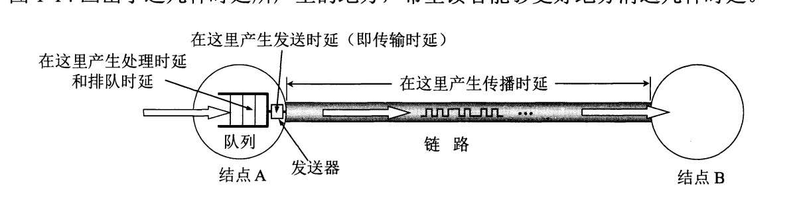
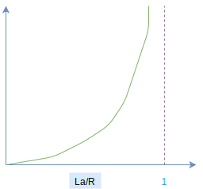

## 一 时延

### 1.0 时延概念

**时延**（delay/latency）是数据从网络的一段传送到另一端所需的时间，也称为延迟、迟延。  

时延由多个部分组成：发送时延、传播时延、处理时延、排队时延。   


### 1.1 发送时延

**发送时延**（transmission delay）：主机或路由器发送数据帧所需要的时间，也即从发送数据帧的第一个比特算起，到该帧的最后一个比特发送完毕所需要的时间。发送时延也称为传输时延。必须等待所有已到达分组传输完毕后，才能传输刚到达的分组。  

发送时延 = $\frac{数据帧长度(bit) }{发送速率(bit/s)}$  

### 1.2 传播时延

**传播时延**(propagation delay)：电磁波在信道中传播一定距离花费的时间，该速度取决于物理媒介。 

传播时延 = $\frac{信道长度(m) }{传播速率(m/s)}$ 

贴士：一般速率范围是 $2\times10^8$ ~ $3\times10^8$，该速度略小于光速。电磁波的速率接近光速，光纤速率为2.0x10$^5$km/s。  

贴士：传输时延是路由器将分组退出所需时间，传播时延是分组在2个路由间传输时间。

### 1.3 处理时延

**处理时延**（nodal processing delay）：主机或路由器收到分组需要划分一定的时间进行分析首部、提取数据、差错检验、路由查找等。   

### 1.4 排队时延

**排队时延**（queuing delay）：分组在网络中，需要经过许多路由器，分组在路由器中需要先在输入队列中排队等待处理。排队时延取决于网络当时的通信量，如果网络通信量很大，就会发生队列溢出，分组丢失，相当于排队时延为无穷大。 

### 1.5 总时延
```
总时延 = 发送时延 + 传播时延 + 处理时延 + 排队时延
```

  

案例：
```
100MB数据块，带宽为1Mbit/s的信道上的时延：
    100MB就是100M字节，1字节为8比特，即100*2的20次方*8
    1Mbit/s，这里的M是10的6次方
```
发送时延为：  
$100 \times 2^{20} \times \div 8 = 838.9s$


## 二 排队时延与丢包

### 2.1 排队时延 

每个分组交换机都连接了多条链路，分组交换机在每条链路上都具有一个 **输出缓存**(output buffer)，也称为 **输出队列**(output queue)，用于存储路由器准备发往该链路的分组。如果分组到达后，却发现该链路整忙于传输其他分组，新到达的分组就必须在缓存中等待，这就会造成 **排队时延**(queue delay)。  

比如：10个分组同时到达空队列，传输的第一个分组没有排队时延，传输的最后一个分组却会受到最大排队时延。所以需要使用统计量测度，如平均排队时延、排队时延的方差、排队时延超过某些特定值的概率。 

排队时延是会变化的，取决于网络的拥塞程度，如：到达该队列的速率、链路的传输速率、到达的流量是周期性还是突发形式。  

**流量强度**（traffic intensity）的公式为：$La/R$。每个分组大小为L比特，分组到达队列的平均速率a（单位分组/秒，pkt/s），R是传输速率。  

如果 $La/R>1$，则比特到达队列的平均速率超过从该队列传输出去的速率，此时会造成队列无限增加，排队延时也会趋向无穷大，所以设计系统流量强度的准则是：**其值不能大于1**。  

在$La/R\leq1$时，影响排队时延的主要因素就是流量的性质，即是周期性到达还是突然大量到达。
```
若分组周期性到达：即每 L/R 秒到达一个分组，则每个分组都会到达空队列，不会有排队时延。  

若分组突发到达：假设每 （L/R）N秒同时到达N个分组，则传输的第一个分组没有排队时延，传输的第二个分组有 L/R 秒的排队时延。
```

上述的案例都是非常理想的情况，分组在实际中到达的过程是随机的，平均排队时延与流量强度关系为：  

  

### 2.2 丢包

缓存的大小有限，若分组到达后，发现该缓存已经被其他等待传输的分组占满，则新到达的分组或者在排队的分组之一会被丢弃，这是 **分组丢失（丢包）**。  

拥塞示例：链路的速率是 1.5Mbps，分组的到达路由器的到达率（换算为每秒比特）超过了 1.5Mbps，就会在缓存中排队。   

分组丢失份额随着流量强度的增加而增加，所以一个节点的性能不仅根据时延来度量，还要根据分组丢失的概率来度量。  

## 三 吞吐量

> 计算机网络性能测度有三个重要指标：时延、丢包、端到端吞吐量。  

比如文件在传播时，有两个吞吐量指标：
- 瞬时吞吐量（instantaneous throughput）：接受党接收到文件的速率（bps）
- 平均吞吐量（average throughput）：接收F比特，耗时T秒，则平均吞吐量为 $F/T bps$

如图所示：服务端向客户端推送一个大文件，中间只经过一个路由，服务端与路由之间链路速率为 $R_s$，路由与客户端之间的速率为  $R_c$：  

  

其吞吐量应该计算为瓶颈链路（bot-tleneck link）的传输速率，即：    
$min\left\{R_s, R_c \right\}$  

解析：
- 如果$R_s < R_c$，服务端数据到达路由后，同样能够顺利的到达客户端，但是其速率只能是 $R_s$
- 如果$R_s > R_c$，服务端以较大速度 $R_s$ 到达路由后，不能再以该速率继续传输，而是更改为 $R_c$速率。

所以传输F比特大文件，其所需时间为：  
$F/min\left\{R_s, R_c \right\}$  

在上述案例的基础上，假定有10个客户端在下载文件，且都会走一个速率为R的公共链路，此时的吞吐量会是多少？
```
如果公共速率R远大于Rs与Rc，那么吞吐量仍然会是 Rs与Rc 中较小的
如果公共速率R并不是很大，Rs=2Mbps，Rc=1Mbps，R=5Mbps，10个客户端平均划分传输速率，此时下载瓶颈就会位于共享链路中，吞吐量就会降低到 500kbps。
```