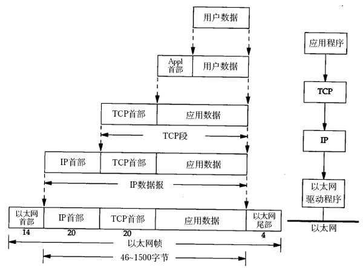
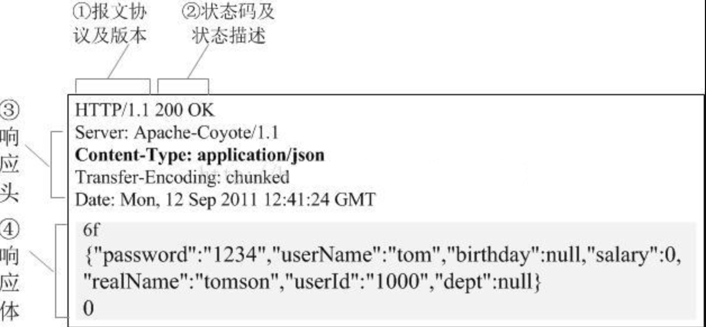

## 一  进程通信

### 1.1 客户服务体系与套接字

在网络中，进程通信针对的是运行在不同端上的进程通信。在两个不同端系统上的进程，通过计算机网络交换报文（message）来进行通信。发起通信方的进程标识为**客户端**（client），在会话开始时，等待联系的进程是**服务端**（server）。  

进程通过一个软件接口向网络发送报文、接收报文，该接口称为**套接字（socket）**，**套接字是同一台主机内应用层与传输层之间的接口**。开发者可以对应用层做任何控制，但是对传输层的控制权限仅限于：
- 选择传输层协议
- 设定传输层参数，如最大缓存、最大报文段长度等

套接字作用：  

  

如上图所示：在发送端，应用程序将报文推进套接字；在接收端，传输层协议会负责将报文传入进程套接字。  

### 1.2 进程寻址

一台主机上运行的进程如果要向另一套主机上运行的进程发送分组，接收进程需要有一个地址来标识接收进程，该标识一般通过两个信息来定义：
- 主机唯一标识地址（**ip**）
- 接收进程的标识符（**port 端口**）

## 二 应用层协议

报文如何构造、报文中字段定义、进程合适发送报文等需要**应用层协议**（application-layer protocol）来定义，即应用层协议用来定义不同端系统之间如何传递报文，如：
- 交换的报文类型：请求报文、响应报文
- 报文语法：报文类型如何定义描述、各个字段语义
- 进程合适发送报文、报文响应规则

应用层协议有公司专用的协议，也有由 **RFC** 文档定义的公共域协议，如HTTP、SMTP。  

常见的应用层协议有：
- HTTP：Web应用协议，常用端口为 80
- FTP：文件传输协议，常用端口为 20，21
- SMTP：邮件应用协议，常用端口为 

## 三 HTTP协议

### 3.0 HTTP协议概述

Web应用层协议是HTTP，即超文本传输协议（HyperText Transfer Protocol，HTTP），其传输层依赖于TCP协议运行，所以发起一个HTTP请求，即要先建立TCP连接，HTTP也就具备了TCP的特性，可靠传输、乱序故障恢复等。  

HTTP是一个无状态协议（stateless protocol），如客户A在几秒内发送2个一样的请求，服务器并不会理解到这是同一个用户，以此来判定第二次请求无效，因为服务端不会存储任何客户A的状态信息。这就需要开发者自己来设定，如利用：cookie等机制。  

### 3.1 非持续连接和持续连接

> 思考：开发者必须做出一个决定，即每个 请求/响应 是经过一个单独TCP连接发送，还是所有的 请求/响应 都经相同的TCP连接发送？

两种连接方式：
- **非持续连接**（non-persistent connection）：每个 请求/响应 是经过一个独立TCP连接发送。
- **持续连接**（persistent connection）：所有的 请求/响应 都经相同的TCP连接发送。  

非持续链接示例：
```
请求一个网页文本 localhost/index.html，文本内部又包含了10个图片链接

步骤一：HTTP客户端发起一个到达 localhost 服务端的 TCP 连接，此时客户端与服务端上分别有一个套接字与该连接相关连
步骤二：HTTP客户端经过它的套接字向服务端发送HTTP请求报文
步骤三：HTTP服务端经过它的套接字接收到客户端发送过来的请求报文，根据报文中的信息查找文件所在地址，封装为响应报文，通过其套接字发送出去
步骤四：HTTP服务端通知TCP断开该连接（只是通知，HTTP客户端完整收到响应报文后才会实际中断）
步骤五：HTTP客户端接收响应报文，TCP连接关闭，该报文在HTML中渲染时，得到10个图片链接

这10个图片链接每个都要重复上述的操作
``` 

在上述示例中，没有明确指出客户端在获取10个图片时，采用的是10个串行TCP连接，还是其中一些图片使用了并行TCP连接。当前浏览器默认支持5-10个并行TCP连接，每条连接处理一个请求/响应事务。不过用户也可以手动设定最大并行连接数为1，这时10条连接就会串行建立。  

**往返时间（Round-Trip Time， RTT）**：一个分组从客户端到服务端然后返回客户端所花费的时间。在非持续连接中，一次去请求就需要两倍RTT交付时延，一个用于创建TCP，一个用于请求、接收一个对象，因为非持续连接中每个请求对象都要建立和维护一个全新的连接。  

使用持续连接时，TCP连接保持打开，示例中10个图形就可以通过单个持续TCP连接进行传送。

### 3.2 HTTP报文格式

HTTP报文有两种：请求报文、响应报文，对应的格式也有差别，如图所示：  

   




### 3.3 其他知识点

HTTP协议还涉及缓存、条件GET等设计，这些知识点将会在独立的HTTP章节提供。  

## 四 FTP协议

### 4.1 FTP协议概述

FTP协议与HTTP协议都是文件传输协议，都运行在TCP之上，但是**FTP使用了两个并行的TCP来传输文件**，分别用来：
- **控制连接**（control connection）：用于在两个主机之间传输控制信息，如用户标识、口令、改变远程目录口令等
- **数据连接**（data connection）：用于实际发送一个文件

由于FTP使用一个独立的控制连接，FTP也被称为**带外**（out-of-band）发送控制信息，HTTP协议由于使用同一个TCP连接发送请求与响应，HTTP可以称呼为**带内**(in-band)发送控制信息。  

   

如图所示：在开始一个FTP会话时，客户端首先与服务端建立一个位于21号端口上的TCP连接，当服务端从该连接上收到一个文件传输的命令后，就会发起一个到客户端的TCP数据连接。在同一个会话期间，如果用户还需要传输另一个文件，FTP会打开另一个数据连接。对FTP协议而言，控制连接贯穿了整个用户会话时间段。  

FTP服务端必须在整个会话期间保留用户的状态（state），尤其是服务器需要把特定的用户账户与控制连接联系起来。随着用户在远程目录树上徘徊，服务器必须追踪用户在远程目录树上的当前位置，同时对会话状态进行追踪，这大大限制了FTP同时可维持的会话总数。而HTTP则是无状态的。  

### 4.2 FTP命令与回答

FTP客户与服务器之间的应答都是以7比特的ASCII格式在控制连接上传送的，常见的命令有：
```
USER username： 用户标识
PASS password： 用户口令
LIST：用于请求服务器会送当前远程目录中的所有文件列表，是一个新建非持续数据连接
RETR filename：用于从远程主机当前目录检索（get）文件，该命令会引起远程主机发送一个数据连接，并经该数据连接发送所请求的文件
STOR filename：用于在远程主机的当前目录上存放（put）文件
```

对应的应答命令：
```
331 Username OK, Password required                      用户名OK，需要口令
124 Data connection already open; transfer starting     数据连接已打开，开始传送
425 Can't open data connection                          无法打开数据连接
452 Error writing file                                  写文件错误
```

## 五  SMTP 邮件协议

### 5.1 邮件系统

邮件系统主要包含三个部分：
- 用户代理（user agent）：负责允许用户阅读、回复、转发、保存、撰写报文，如Outlook、QQ邮箱 
- 邮件服务器（mail server）：接收到的用户邮件放置在邮件服务器的外出报文队列中。
- 简单邮件传输协议（sIMPLE Mail Transfer Protocol， SMTP）：基于TCP的传输协议

邮件发送的具体过程，如图所示：  

  

解释如下：
```
用户A发送邮件：
    用户A调用其邮件代理程序，填写用户B的邮件地址，撰写报文，并提交发送报文
    用户A的邮件代理程序将报文发送到用户A的邮件服务器，报文此时被放置在报文队列
    用户A的邮件服务器上的SMTP客户端发现报文队列中这个报文后，会创建一个连接到用户B的邮件服务器的TCP连接
    经过握手后，用户A的邮件服务器上的SMTP客户端通过该TCP连接发送报文

用户B接收邮件：
    用户B的邮件服务器上接收到报文，将报文存入B的邮箱中
    用户B在方便的时候，调用其用户代理阅读该报文

异常处理：
    如果用户A邮件服务器不能将邮件交付给用户B邮件服务器，则发送这邮件服务器会在 报文队列（message queue）中保持该报文，并在以后尝试再次发送。若尝试不成功，则服务器会删除该报文
```

注意：**邮件服务器一般不使用中间邮件服务器发送邮件**，即香港邮件服务器发送邮件给加拿大邮件服务器，二者是直连的。  

简单理解：
```
每个接收方在其对应邮件服务器上都有一个邮箱；
发送方经过用户代理，传到到发送方的邮件服务器，再传递到接收方的邮件服务器，在接收方服务器内分发到接收方邮箱；
用户在其邮箱中读取报文时，必须包含其邮件服务器的用户名和口令，来鉴权；
```

### 5.2 SMTP传输协议

SMTP协议也拥有两部分：运行在发送方邮件服务器的客户端、运行在接收方邮件服务器的服务端，常用端口为 25。 

舒勇telnet可以与SMTP进行一次直接对话：
```
telnet serverName 25
```

SMTP与HTTP对比：
```
如果二者都需要文件传输时，HTTP与SMTP都需要使用持续连接
HTTTP主要是一个拉协议（pull protocol），SMTP是一个推协议（push protocol）
SMTP要求每个报文都使用7比特ASCII码格式（或者用该格式编码），HTTP则不受限制
```

邮件内容包括：首部行与报文体，二者使用回车空行隔开。
- 首部行：必须包含From、To，也可选包含Subject
- 报文体：ASCII码格式

首部行示例：
```
From: ruyuejun@gmail.com
To: ruyuejiang@163.com
Subject: 人生的意义
```
### 5.3 邮件访问协议

邮件通过SMTP协议到达接收方邮件服务器后，还需要经过邮件访问协议获取该邮件。因为取报文是一个拉操作，而SMTP协议是一个推协议。   

常用的邮件访问协议有：
- 第三版邮局协议（POP3，Post Office Protocol）：
- 因特网邮件访问协议（IMAP，Internet Mail Access Protocol）：
- HTTP协议：

POP3：代理端打开邮件服务器上110端口的TCP连接后，该协议开始工作，分为三个阶段：
- 阶段一：特许。用户代理以明文形式发送用户名和口令
- 阶段二：事务处理，即用户代理取回报文，并可以对报文进行删除、获取邮件统计信息等操作
- 阶段三：更新，即用户代理发出quit命令后，结束会话。

示例：
```
# 阶段一：特许
telnet mailServer 100
+OK POP3 server ready                       # 若命令错误，则返回 -ERR
user Tom
+OK
pass 233
+OK user successfully logged on

# 阶段二： 事务
客户端：list
服务端：1 498
服务端：2 912
服务端：.
客户端：retr 1
服务端：(......)
服务端：.

# 阶段三： 更新
quit
+OK POP3 server signing off
```

IMAP让用户在POP3原有的功能上，直接操作远程服务器上的层次文件夹。  

关于HTTP：在当下，浏览器充当了Web场景中的代理作用，电子邮件报文从邮件服务器发往接收者浏览器时，使用的是HTTP，而不是POP3或者IMAP。  

## 六 DNS协议

DMS协议也是应用层协议，因为其仍然使用客户-服务器模式运行在端系统之间，而且端系统间也仍然依靠传输协议来传输DNS报文，但是其作用与FTP、HTTP完全不同。  

DNS协议不与用户直接打交道，而是给HTTP、SMTP、FTP等协议使用，将主机名转换为IP地址。    

但是由于主机名在庞大的互联网中数量极多，没有一台DNS服务器拥有全部的主机与IP映射。大致有三类DNS服务器：
- 根DNS服务器：全球拥有13个根DNS服务器（网络），标号为A-M。
- 顶级域（Top-level Domain，TLD）DNS服务器：如com、org、net等
- 权威DNS服务器：如大学、电信公司等维护的DNS服务器

一般如果要访问一个网址，首先会与根服务器之一联系，它将返回顶级域名的TLD服务器IP地址，然后该客户会与一个TLD服务器联系，该TLD服务器会返回权威服务器的IPD地址，最后在权威服务器详细查找DNS。  

要注意的是每个ISP（大学、公司、小区）本地也会拥有一份DNS，称为本地DNS服务器（local DNS server），该ISP将提供一台主机的IP地址，这个主机机能提供多台本地DNS服务器的IP地址。当主机发出DNS请求时，该请求会被发往本地DNS服务器，起到了代理作用。  

   

为了改善时延，减少因特网上DNS报文传输数量，DNS采取了缓存策略（DNS caching）。在一个请求链中，某个DNS服务器接收到了一个DNS回答（包括主机与IP映射），它能够将改回答中的信息缓存到本地存储器中。  

TTL是记录的生存时间，决定资源记录从缓存中删除的时间。   


