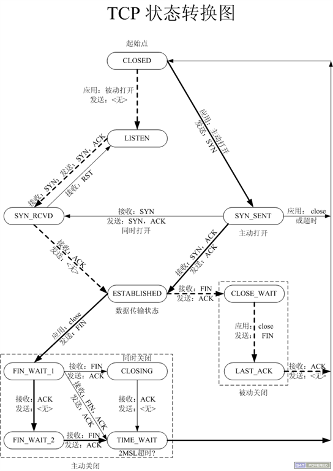

## 一 TCP状态转换概念

TCP握手的详细图：  

   
```
CLOSED：表示初始状态。
LISTEN：该状态表示服务器端的某个SOCKET处于监听状态，可以接受连接。
SYN_SENT：这个状态与SYN_RCVD遥相呼应，当客户端SOCKET执行CONNECT连接时，它首先发送SYN报文，随即进入到了SYN_SENT状态，并等待服务端的发送三次握手中的第2个报文。SYN_SENT状态表示客户端已发送SYN报文。
SYN_RCVD: 该状态表示接收到SYN报文，在正常情况下，这个状态是服务器端的SOCKET在建立TCP连接时的三次握手会话过程中的一个中间状态，很短暂。此种状态时，当收到客户端的ACK报文后，会进入到ESTABLISHED状态。
ESTABLISHED：表示连接已经建立。
FIN_WAIT_1:  FIN_WAIT_1和FIN_WAIT_2状态的真正含义都是表示等待对方的FIN报文。区别是：
FIN_WAIT_1状态是当socket在ESTABLISHED状态时，想主动关闭连接，向对方发送了FIN报文，此时该socket进入到FIN_WAIT_1状态。
FIN_WAIT_2状态是当对方回应ACK后，该socket进入到FIN_WAIT_2状态，正常情况下，对方应马上回应ACK报文，所以FIN_WAIT_1状态一般较难见到，而FIN_WAIT_2状态可用netstat看到。
FIN_WAIT_2：主动关闭链接的一方，发出FIN收到ACK以后进入该状态。称之为半连接或半关闭状态。该状态下的socket只能接收数据，不能发。
TIME_WAIT: 表示收到了对方的FIN报文，并发送出了ACK报文，等2MSL后即可回到CLOSED可用状态。如果FIN_WAIT_1状态下，收到对方同时带 FIN标志和ACK标志的报文时，可以直接进入到TIME_WAIT状态，而无须经过FIN_WAIT_2状态。
CLOSING: 这种状态较特殊，属于一种较罕见的状态。正常情况下，当你发送FIN报文后，按理来说是应该先收到（或同时收到）对方的 ACK报文，再收到对方的FIN报文。但是CLOSING状态表示你发送FIN报文后，并没有收到对方的ACK报文，反而却也收到了对方的FIN报文。什么情况下会出现此种情况呢？如果双方几乎在同时close一个SOCKET的话，那么就出现了双方同时发送FIN报文的情况，也即会出现CLOSING状态，表示双方都正在关闭SOCKET连接。
CLOSE_WAIT: 此种状态表示在等待关闭。当对方关闭一个SOCKET后发送FIN报文给自己，系统会回应一个ACK报文给对方，此时则进入到CLOSE_WAIT状态。接下来呢，察看是否还有数据发送给对方，如果没有可以 close这个SOCKET，发送FIN报文给对方，即关闭连接。所以在CLOSE_WAIT状态下，需要关闭连接。
LAST_ACK: 该状态是被动关闭一方在发送FIN报文后，最后等待对方的ACK报文。当收到ACK报文后，即可以进入到CLOSED可用状态。
```

## 二 半关闭

当TCP链接中A发送FIN请求关闭，B端回应ACK后（A端进入FIN_WAIT_2状态），B没有立即发送FIN给A时，A方处在半链接状态，此时A可以接收B发送的数据，但是A已不能再向B发送数据。  

从程序的角度，可以使用API来控制实现半连接状态：
```c
#include <sys/socket.h>
int shutdown(int sockfd, int how);
sockfd: 需要关闭的socket的描述符
how:	允许为shutdown操作选择以下几种方式:
	SHUT_RD(0)：	关闭sockfd上的读功能，此选项将不允许sockfd进行读操作。
					该套接字不再接收数据，任何当前在套接字接受缓冲区的数据将被无声的丢弃掉。
	SHUT_WR(1):		关闭sockfd的写功能，此选项将不允许sockfd进行写操作。进程不能在对此套接字发出写操作。
	SHUT_RDWR(2):	关闭sockfd的读写功能。相当于调用shutdown两次：首先是以SHUT_RD,然后以SHUT_WR。
```

使用close中止一个连接，但它只是减少描述符的引用计数，并不直接关闭连接，只有当描述符的引用计数为0时才关闭连接。  

shutdown不考虑描述符的引用计数，直接关闭描述符。也可选择中止一个方向的连接，只中止读或只中止写。  

注意:
- 1.如果有多个进程共享一个套接字，close每被调用一次，计数减1，直到计数为0时，也就是所用进程都调用了close，套接字将被释放。 
- 2.在多进程中如果一个进程调用了shutdown(sfd, SHUT_RDWR)后，其它的进程将无法进行通信。但，如果一个进程close(sfd)将不会影响到其它进程。

