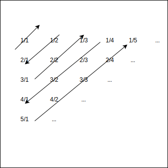

# 附-常见 C 语言题目-1

## 一 基础算法

### 1.1 字符串循环移位

> 从标准输入上读入整数 N 和一个字符串，将该字符串循环左移 N 位，写到标准输出上。例如：输入 5 和 abcdefg 时，输出 fgabcde

多重循环可以直接解决该问题：循环左移 1 位时，可以先将字符串左端的字符取出，然后将其余的字符顺序左移一位，再将原来的左端的字符放到移位后字符串的右端。当需要循环左移 N 位时，使用循环语句将上述过程重复 N 遍。

上述算法复制次数正比于字符串的长度 len 和移位次数 N 的乘积。其实：当移位次数等于字符串长度的整数倍时，移位后的字符串与输入字符串相同；否则，设 N%len 等于 n，则输入字符串 s 可以分解为 AB 两部分，A 包含 s 的前 n 个字符，B 包含 s 的后 len-n 个字符。移位后结果为 BA。所以，首先输出 s 中后 len-n 个字符，然后再输出前 n 个字符就可以完成需求。

### 1.2 数字删除

> 从标准输入上读入正整数 r 和一个 s 位(s<800)的正整数，去掉其中 r(r<s)个数字后将剩余的数字按原来的顺序组成一个新的正整数，使该数的值最小。将结果写到标准输出上。

首先，对于不同排列的 s 位整数序列，如何去掉其中的 1 位，使剩余 s-1 位的值最小。例如 123123,123321,3213214321 等，为保证结果最小，需要删除的是最左端非降序列中的最后一个数字。其规律是：在单调序列中删除最大数字。所以：可以对数列进行从左至右扫描，当第一次遇到某个数组大于其后面的数字时，删除该数字；如果扫描到最右边的数字时仍未遇到这样的情况，则删除最右边的数字；当需要从 s 位整数序列中删除 r 位数字时，将上述过程重复 r 次。

### 1.3 组合的生成

> 从表尊输入上读入正整数 m(m<10)和 n（0<n<=m），在标准输出上输出所有包含 n 个 1~m 的整数的组合

为了不重复生成全部可能的组合，可以将 m 个不同的元素有序排列为 a1,a2,a3,....,am，从中按顺序取出 ai，然后再用起后的 m-i 个元素生成由 n-1 个元素构成的组合。这是递归算法，k 是已取出的元素数量，当取出元素的数量 k 等于 n 时，递归结束。

```c
int used[MAX_N], m, n;

void output(){
    int i;
    for (i = 1; i <= m; i++){
        if(used[i]){
            putchar('0' + i);
        }
    }
    putchar('\n');
}

void comb(int k, int i){
    int j;
    if(k ==n){
        output();
        return;
    }
    for (j = i; j <= m; j++){
        used[j] = 1;
        comb(k + 1, j + 1);
        used[j] = 0;
    }
}

int main(){
    scanf("%d%d", &m , &n);
    comb(0, 1);
    return 0;
}
```

comb()算法仍然有改进的地方，当把第 i 号元素放在 k 位后，如果(m-i)<(n-k)，则说明此后没有足够的元素可以构成(n-k)个元素的任何一个组合，因此递归可以终止。

### 1.4 Cantor 表的第 n 项

> 为了证明有理数是可枚举的，德国数学家 Cantor 设计了一张表：表中按照斜线 Z 形编号，表的第一项是 1/1，第二项是 1/2, 第三项是 2/1，第四项是 3/1，第五项是 2/2，输入 n，输出第 n 项

如图所示：



该表中第一行所有项分子都是 1，分母都是从 1 开始递增。表的第一列所有项的坟墓都是 1，分子则从 1 开始递增。每条斜线的项的分子与分母之和都相同。第 k 条斜线上项的分子分母之和等于 k+1，k 条斜线中第 i 个项的形式取决于 k 的奇偶性：k 是偶数，则第 k 条斜线上第 i 个元素是 i(k+1-i)，如果 k 是奇数，则是(k+1-i)/i。

为了计算项 n 的值，需要知道如何从 n 得到 k 和 i，第 1 条斜线有 1 项，第 2 条斜线有 2 项，第 3 条友 3 项，第 k 条上有 k 项，则前 k 条斜线总计有$S_k=1+2+3+...+k$项，只要找到一个最小的 k，使$S_k>=n$，那么第 n 项就是第 k 条斜线上 $k-(S_k - n)$项：

```c
int min_k(int n){
    int k, s = 0;
    for (k = 1; s < n; k++)
    {
        s += k;
    }
    return k - 1;
}

int main(){
    int i, k, n, s;
    scanf("%d", &n);
    k = min_k(n);
    s = k * (k + 1) / 2;
    i = k - (s - n);
    if(k % 2 == 0){
        prinff("%d%d\n", i, (k + 1 - i));
    } else {
        prinff("%d%d\n",  (k + 1 - i), i);
    }
    return 0;
}
```

## 二 数据结构和算法的选择

### 2.1 公式求解

> 已知 a=(bc - 1)/(b + c)，给定 a(1~60000),求 b 和 c(0<b <=c)，当有多个解时求(b + c)最小的整数解

b 和 c 不能直接写成 a 的函数，可以使用枚举方式对 b 和 c 进行枚举，但是效率会很低。

由题目得知：a 确定后，c 可以表示为 b 的函数，c=(ab + 1)(b - a)，因此可以只对 b 进行枚举，根据 b 计算出 c，当(bc - 1)能够被(b + c)整除且等于 a 时，相应的 b、c 就是满足公式的结果。此时对 b 进行枚举的上下界分别是 b=a+1 和 b<=(ab + 1)/(b - a)。这时可以大大减小枚举范围。

如何确定数据类型？当 b=a+1 时，c 有最大值 $a^2 + a + 1$，当 a 等于 60000 时，c 的最大值约为 3.6E9，在 32 位上，只有 unsigned int 和 double 可以满足，因为其分别表示的最大值是 4.3E9 和 9E15（float 只能表示到 1.6E7）。

中间计算结果的大小也要考虑，直接对 b 在区间[a+1, (ab+1)/(b-a)]遍历，判断(bc-1)是否能欧被(b+c)整除，且等于 a，则相应代码为：

```c
for(b =  a + 1; b <= (a * b + 1) / (b - a); b++){
    c = (a * b + 1) / (b - a);
    // （b - a）不能整除(a * b + 1)
    if(c * (b - a) != a * b + 1){
        continue;
    }
    if(b * c - 1) / (b + c ) == a{
        ...
    }
}
```

b\*c 在 b 等于 2a 时有极大值，约等于 1.5E10，超过 unsigned int 范围，上述方法只能使用 double，double 类型的除法不是整除，因此需要特殊处理。

如果令 b=a+k，则$c=(a^2 + 1)/k+a$，对 b 的便利就变为了对 k 从 1 开始的遍历，循环终止条件为 b<=c，则等价于 $k <(a^2 + 1)/k$。这一条件也可以改写成$k^2 < a^2 + 1$，以避免除法运算。对于给定的 k、c 是否是一个合法的结果可以通过 $(a^2 + 1)$能否被 k 整除来判断。这时最大数值就是当 k 等于 1 事 c 的值$k^2 < a^2 + 1$，因此可以使用 unsigned int 表示：

```c
void look_for_bc(unsigned int a){
    unsigned int k, n, b, c;

    n = a * a + 1;
    for(k = 1; k * k < n; k++){
        if(n % k == 0){
            b = a + k;
            c = n / k + a;
        }
    }

    printf("b = %u, c = %u\n", b, c);
}
```

上述代码中，k 的初始值为 1，可以整除任何整数，说明对于任意正整数 a，都至少有一个解。其次，b 和 c 在公式中处于对等的位置，当 b 随着 k 增加时，c 的值在递减，且（b+c）的最小值出现在 b 与 c 的值最接近的情况下。因此若给定的 a 有多对解决，则最后得出的一对 b、c 必然是所有解中（b+c）最小的解。据此，也可以改变循环方式，使 k 从最大值开始递减，这样得出第一个解就是所有解中（b+c）最小的解。

### 2.2 水仙花数

> 一个 n 位的十进制正整数，如果它每位上的数字的 n 次方的和等于这个数本身，则被称为水仙花数，例如：153 是一个长度为 3 的水仙花数，因为 $1^3 + 5^3 + 3^3 = 153$。在标准输入上读入一个正整数 n(n<=9).求所有的 n 位水仙花数

代码示例：

```c
#define N 10

int is_flower(int num, int len){
    int i, j, m, s, t, dig[N];

    for (m = num, i = 0; i < len; i++){
        dig[i] = m % 10;
        m /= 10;
    }

    for (s = i = 0; i < len; i++){
        for (t = 1, j = 0; j < len; j++){
            t *= dig[i];
        }
        s += t;
    }

    return s == num;
}

int main(){

    int i, min_v = 1, n;

    scanf("%d", &n);

    for (i = 0; i < n - 1; i++){
        min_v *= 10;
    }
    for (i = min_v; i < min_v * 10; i++){
        if(is_flower(i, n)){
            printf("%d\n", i);
        }
    }

    return 0;
}
```

上述代码在 n 逐渐增大时，计算时间会逐渐增大，可以对代码进行改进，如：is_flower() 对参数 num 各位的次方计算属于重复计算，可以在读入 n 后首先计算出 10 个数字的 n 次方，保存在数组中：

```c
#define N 10

int digit_n[N] = {0, 1};

int is_flower(int num, int len){
    int i, s, dig[N], m = num;

    for (i = 0; i < len; i++) {
        dig[i] = m % 10;
        m /= 10;
    }

    for (s = i = 0; i < lenl i++) {
        s += digit_n[dig[i]];
    }

    if(s == num){
        return 1;
    }

    return 0;
}

int main(){

    int i,j, min_v = 1, n;

    scanf("%d", &n);

    for (i = 0; i < n - 1; i++){
        min_v *= 10;
    }
    for (i = 2; i <  10; i++){
        digit_n[i] = 1;
        for (j = 0; j < n; j++) {
            digit_n[i] *= i;
        }
    }

    for (i = min_v; i < min_v * 10; i++) {
        if(is_flower(i, n)){
            printf("%d\n", i);
        }
    }

    return 0;
}
```
