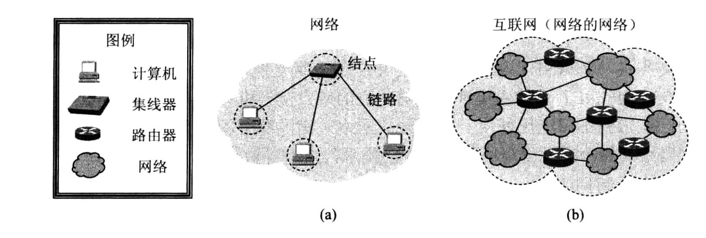
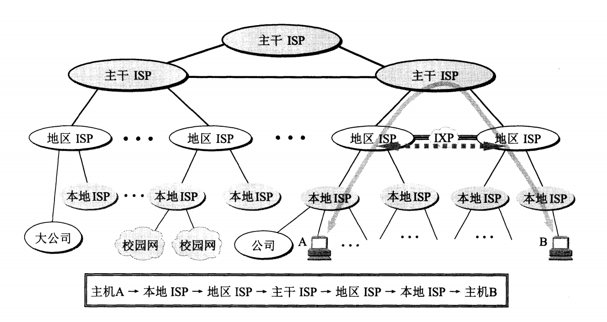
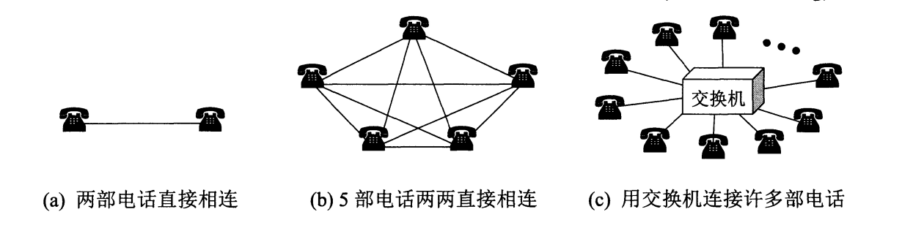
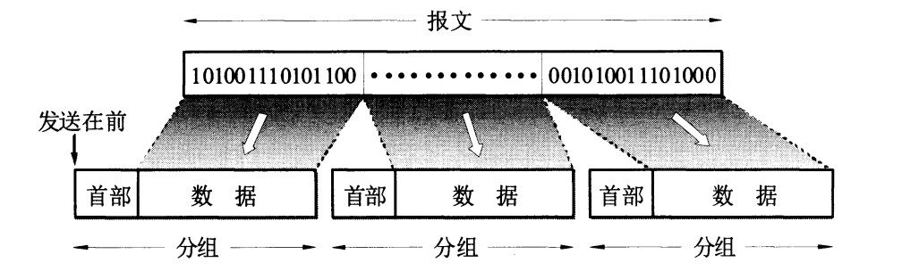

# 01-网络概述

## 一 网络基础

### 1.1 网络的网络

网络（network）由若干结点（node）、连接结点的链路（link）组成。结点可以是计算机、集线器、交换机、路由器等，如图所示：



网络和网络通过路由器互连起来，形成了网络的网络（network of networkds），因特网是世界上最大的互连网络。

```txt
网络把许多计算机连接在了一起；
因特网把许多网络连接在了一起；
与网络相连的计算机被称为主机（host）。
```

**因特网**是世界范围的计算机网络，互联了全世界亿级数量的网络设备。这些设备可以是：传统 PC、Linux 工作站、移动设备、安全系统等等，他们统称为**主机(host)/端系统(end system)**。

### 1.2 ISP

ISP 也被译作 互联网服务提供商，如中国电信、中国联通、中国移动。ISP 可以从互联网管理机构申请到很多 IP 地址，同时拥有通信线路、路由等连网设备，如大公司自建通信线路，小公司租用通信线路。

任何机构或个人都可以通过 ISP 购买的 IP，通过该 ISP 接入互联网。

ISP 可以分为：

- 主干 ISP：一般覆盖全国，拥有高速主干网(10Gbit/s)
- 地区 ISP：地区 ISP 通过一个或多个主干 ISP 连接
- 本地 ISP：给用户提供直接服务，本地 ISP 可以连接到地区 ISP，也可以连接到主干 ISP。本地 ISP 一般为互联网服务于公司、学校等。

如图所示：



IXP(Internet eXchange Point)是互联网交换点，为了应对快速转发分组，有效利用网络资源而诞生。其作用是允许两个网络相连并交换分组，而不再额外需要第三个网络来转发分组。

## 二 端系统的连接与协议

### 2.1 端系统的连接

> **分组**（packet）：一台端系统向另一台端系统发送时，发送端系统将数据分段，为每段都加上首部字节，形成的数据包称为分组。

端系统之间如果要连接（发送与接收数据），需要两个因素：

- **通信链路**（communication link）：负责传输数据，一般是类似光纤、无线电频谱这样的物理媒体。
  - 传输速度单位为：比特/秒（bit/s，或 bps）
- **分组交换机**（packet switch）：负责从 入通信链路 中接收到达的分组，并从一条 出通信链路 中转发该分组。
  - 常见的有路由器（roter）、链路层交换机（link-layer switch），他们都是用来向最终目的地转发分组。

> **路径**（path/route）:从最初的发送端到最终的接收端，一个分组所经历的一系列通信链路、分组交换机称为路径。类似现实中的交通网络，分组要到达目的地，需要选择计算机网络中的一条路径前行。

端系统通过因特网服务提供商（Internet Service Provider，ISP）接入因特网，他们会提供在机场、旅馆、公司等地可以接入的 ISP。ISP 也会将各种 Web 站点接入因特网。底层的 ISP 通过国家的高层 ISP 互联起来。


### 2.2 协议

**协议**（protocol）：用来定义两个、多个通信实体之间交换的报文格式、次序，以及在发送与接收时需要采取的动作

在现实生活中，我们与别人交流也是需要一定的步骤的，比如先打招呼，计算机也同样如此，下图展示了一个粗略的协议规范：  


### 2.3 标准化

互联网的标准都是以 RFC 文档形式在互联网上发表，RFC 即”请求评论“。

## 三 路由与交换

### 3.1 电路交换

电话中，信息的交换方式是电路交换（circuit switching）。其产生的原因是：降低电话机之间两两直连的成本。如图所示：



从通信资源的分配角度来看，交换就是按照某种方式动态的分配传输线路资源。

```txt
拨号请求建立连接，
被叫用户听到铃声接机后
此时从主叫端到被叫端建立了一条连接，即一条专用的物理通路，该通路不会被其他用户占用。
```

上述步骤中，通过建立连接、通话、释放连接三步实现的交换方式称为**电路交换**。

电路交换的重要特点是：通话的全部时间内，通话的两个用户始终占用端到端的通信资源。该方式下线路的传输效率很低。比如连接建立后，用户在编辑、阅读屏幕中的文件，没有进行数据传输，则通信线路资源被白白占用了。

如图所示：

### 3.2 分组交换

分组交换采用**存储转发技术**，即把一个报文划分为几个分组后再进行传送。例如一个完整的数据块报文（message），被划分为一个个更小的登场数据段，这些数据段需要加上首部（header），就会成为一个分组（packet）。



路由的作用就是用来转发这些分组，即进行分组交换，路由可以看为网络核心部分的结点，转发时则将网络简化为了一个链路。

```txt
路由接收到一个分组，暂时存储下来。
接着检查其首部，查找转发表
按照首部中的目的地址，找到合适的接口转发出去，把分组交给下一个路由，直到交付给最终目的主机
```

注意：分组交换再传送数据之前不必先占用一条端到端的链路通信资源，分组在哪段链路上传送才会占用这段链路的通信资源。

分组交换的问题：**时延**，额外开销等。

```txt
分组在各个路由器存储转发时需要排队，会造成时延。
分组必须携带控制信息，造成了一定的开销。
```

### 3.3 对比

- 分组交换不适合实时服务：端到端的时延不可预测（因为排队时延不可预测）。
- 分组交换能提供比电路交换更好的带宽共享，比电路交换简单有效，成本更低。比如多个用户共享 1Mbps 链路，用户的活跃周期是变化的，某用户时而以 100kbps 恒定速率产生数据，时而静止不再产生数据，如果采用电路交换，则需要为每个用户都预留 100kbps，那么电路交换支持的用户并发数就会很低。

## 四 计算机网络的性能

### 4.1 速率

计算法信号都是二进制数字，一个 bit 就是 1 或者 0，计算机网络的速率即数据的传送速率，称为数据率（data rate）/比特率（bit rate），单位为 `bit/s(比特/秒)，或者写为 b/s，bps等`。

贴士：实际使用中，往往在单位前加一个字母表示倍数，如 1kb/s。

### 4.2 带宽

带宽的本义是信号的频带宽度，单位为 Hz。但是在计算机网络中，带宽表示网络中某个通道传输数据的能力，即单位时间内网络中某信道所能通过的最高数据率，所以此时带宽的单位也是 bit/s。

### 4.3 吞吐量

吞吐量（throughput）：单位时间内通过某个网络的实际数据量，所以吞吐量收到了带宽等限制。也可以这样说，额定速率其实就是吞吐量的绝对上限值。

### 4.4 时延

下一章节详细介绍：

```txt
总时延 = 发送时延 + 传播时延 + 处理时延 + 排队时延
```

### 4.5 时延带宽积

传播时延带宽积极传播时延与带宽相乘的结果，该值可以用来标识链路可以容纳多少比特，所以也可以称为以比特位单位的链路长度。

### 4.6 往返时间 RTT 重要

往返时间 RTT(Round-Trip Time)代表一次完整的双向交互时间。

### 4.7 利用率

利用率有两种：

- 信道利用率：某个信道有百分之几的时间是被利用的（有数据通过）
- 网络利用率：全网络信道利用率的加权平均值

如果$D_0$表示网络空闲的时延，$D$表示当前时延，则适当假定条件下，有：

$D=\frac{D_0}{1-U}$ （U 即网络利用率）
